# Migração do Domínio PROVID — Genesis → Nexus

> Documento de Engenharia Reversa e Plano de Migração de Domínio
> Programa de Policiamento de Prevenção Orientada à Violência Doméstica (PROVID) — PMDF
> Origem: `Genesis.WebApp.MVC` (.NET MVC / SQL Server) · Destino: plataforma **Nexus** (`nexus-backend` Quarkus/Java 21 + `nexus-frontend` Angular 17)
> Natureza: análise e proposta. **Nenhum código foi alterado** nos projetos. Este artefato consolida os 11 entregáveis obrigatórios do prompt mestre de migração.

---

## Sumário

1. [Resumo Executivo](#1-resumo-executivo)
2. [Descobertas do Domínio](#2-descobertas-do-domínio)
3. [Regras de Negócio](#3-regras-de-negócio)
4. [Modelo de Dados e Dependências](#4-modelo-de-dados-e-dependências)
5. [Requisitos Funcionais e Não Funcionais](#5-requisitos-funcionais-e-não-funcionais)
6. [Análise de Riscos de Migração](#6-análise-de-riscos-de-migração)
7. [Proposta Arquitetural Nexus](#7-proposta-arquitetural-nexus)
8. [Estratégia Event-Driven](#8-estratégia-event-driven)
9. [Plano de Migração](#9-plano-de-migração)
10. [Estratégia de Testes](#10-estratégia-de-testes)
11. [Estratégia de Observabilidade](#11-estratégia-de-observabilidade)
12. [Checklist de Homologação](#12-checklist-de-homologação)
13. [Apêndices](#13-apêndices)

---

## Nota sobre stack-alvo (divergência prompt × realidade)

O prompt mestre assume stack-alvo **Spring Boot/Quarkus + SQL Server + Flyway**. A inspeção do repositório `nexus-backend` mostra a stack **real** em produção:

| Item | Prompt mestre | Realidade do `nexus-backend` | Decisão deste documento |
|---|---|---|---|
| Runtime | Java 21 + Spring Boot/Quarkus | **Quarkus 3.17.5 + Java 21** | Quarkus |
| Persistência | SQL Server | **MongoDB (Panache)** | MongoDB |
| Migração de schema | Flyway | Sem Flyway; índices via código (`MongoIndexInitializer`) | Índices programáticos + ETL próprio |
| Mensageria | RabbitMQ | **RabbitMQ (SmallRye Reactive Messaging)** | RabbitMQ |
| Cache | Redis | **Redis (Quarkus Cache)** | Redis |
| Segurança | Keycloak/OIDC/JWT | **Keycloak/OIDC/JWT + `@RolesAllowed`** | Keycloak |
| Observabilidade | OpenTelemetry | **Micrometer + Prometheus** (OTel não presente) | Micrometer/Prometheus |
| Frontend | Angular 17+ | **Angular 17 standalone + Vex + Material + Tailwind + ApexCharts** | mantém |

> **Implicação central:** a migração não será relacional→relacional. Será uma **remodelagem de domínio** do modelo relacional `PROVID_*` (SQL Server) para **agregados orientados a documento** no MongoDB, preservando regras de negócio, invariantes e fluxos. As seções de dados e migração refletem essa escolha.

---

## 1. Resumo Executivo

### 1.1 O que é o PROVID

O PROVID é um domínio crítico da PMDF voltado ao **acompanhamento de vítimas de violência doméstica**. No Genesis ele convive como módulo do monólito `Genesis.WebApp.MVC` e combina **dois eixos operacionais**:

1. **Processo PROVID** — caso estruturado em wizard (dados do caso → pessoas atendidas → visitas → andamentos → encerramento), com máquina de estados própria e numeração sequencial por unidade/ano.
2. **RAP (Registro de Atendimento Policial)** — fonte de ocorrências. Alimenta a **Busca Ativa** (varredura de ocorrências de violência doméstica sem processo aberto) e possui um tipo dedicado (`Oco_Tipo = 6`, "RAP PROVID") com ciclo próprio de homologação.

### 1.2 Por que migrar

| Dor atual | Impacto |
|---|---|
| Forte acoplamento a MVC, Razor, EF Core + Dapper, SQL compartilhado | Evolução lenta, risco de regressão em cascata |
| Regras espalhadas entre controllers, services, repositórios e views | Conhecimento de domínio implícito e frágil |
| Dependência de `IAspNetUser`, views SGPOL e tabelas genéricas compartilhadas | Difícil isolar e escalar o domínio |
| Notificações de workflow são apenas `log` (stub) | Funcionalidade prometida não entregue |
| Regras de piloto hardcoded em views (menu por UPM 25/10034) | Governança difícil |

### 1.3 Estratégia recomendada (visão de topo)

- **Migrar o domínio, não o código.** Tratar o legado como fonte de conhecimento.
- Modelar o PROVID como **bounded context próprio** no Nexus, em arquitetura hexagonal, com agregado raiz `Processo` e agregados/coleções de apoio.
- Adotar **arquitetura orientada a eventos** (RabbitMQ) para os marcos do ciclo de vida (Processo Criado, Finalizado, Homologado, Protocolado, Visita Registrada, RAP de Violência Doméstica Registrado).
- Substituir `IAspNetUser` por **claims JWT (Keycloak)**, preservando isolamento por **UPM** (unidade), auditoria e rastreabilidade.
- Migração de dados em **ondas** com backfill ETL relacional→documento, validação e operação em paralelo (dual-run) durante a transição.

### 1.4 Marcos e ondas (resumo)

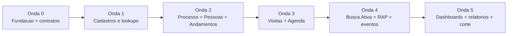

---

## 2. Descobertas do Domínio

### 2.1 Glossário (linguagem ubíqua)

| Termo | Definição no domínio | Origem legada |
|---|---|---|
| **PROVID** | Programa de Policiamento de Prevenção Orientada à Violência Doméstica | módulo `Provid` |
| **Processo PROVID** | Caso de acompanhamento de uma situação de violência doméstica, com pessoas, visitas e andamentos | `PROVID_PROCESSO` |
| **Pessoa Atendida** | Pessoa física vinculada ao processo, com papel (vítima/agressor/outro) | `PROVID_PESSOAATENDIDA` |
| **Envolvimento** | Papel da pessoa no processo (vítima, agressor, etc.) | `TipoEnvolvimento` |
| **Vínculo (ofensor)** | Relação da pessoa com o ofensor | `PROVID_VINCULO` |
| **Visita (acompanhamento)** | Visita de acompanhamento a uma pessoa atendida | `PROVID_ATENDIMENTO` |
| **Visita inicial / palestra** | Visita institucional ou palestra, pode gerar processo | `PROVID_VISITA` |
| **Andamento** | Registro cronológico de evento no processo (trilha funcional) | `PROVID_ANDAMENTO` |
| **Contexto** | Tipo de violência associado ao processo (N:N) | `PROVID_CONTEXTO` |
| **Busca Ativa** | Fila de RAPs de violência doméstica sem processo PROVID aberto, para triagem | `PROVID_BUSCAATIVA` |
| **Baixa (da Busca Ativa)** | Justificativa de por que um RAP não virou processo | campo `Justificativa` |
| **RAP** | Registro de Atendimento Policial (ocorrência) | `Ocorrencias` |
| **RAP PROVID** | RAP do tipo dedicado ao PROVID | `Oco_Tipo = 6` |
| **Homologação (Processo)** | Transição de status `Finalizado → Homologado` por homologador | workflow |
| **Homologação (RAP)** | Aprovação de RAP PROVID finalizado | `RapAdminService` |
| **Workflow** | Máquina de estados do processo, data-driven | `PROVID_WORKFLOW(_PERMISSAO)` |
| **Agenda** | Calendário de visitas vinculadas a RAP ou Processo | `PROVID_AGENDA` |
| **Equipe** | Grupo de policiais PROVID de uma UPM | `PROVID_EQUIPE/COMPONENTE` |
| **UPM** | Unidade Policial Militar (unidade de lotação) — eixo de isolamento | `IdUpm` |
| **SGPOL** | Sistema de gestão de pessoal; fonte de efetivo/lotação via views | `SGPOL_VWPolicial`, `SGPOL_VWUpms` |
| **Responsável** | Policial responsável pelo processo (por matrícula) | `Responsavel` |

### 2.2 Atores e perfis

| Ator / Perfil | Claim Keycloak → Policy | Capacidades no PROVID |
|---|---|---|
| **Operador PROVID** | `Provid` / `Provid Gestão` → policy `PROVID` | Criar/editar processos, pessoas, visitas, andamentos; operar Busca Ativa; agenda |
| **Homologador** | `Homologador` → policy `HOMOLOGADOR` | Homologar processos (`Finalizado→Homologado`) e RAPs PROVID; cancelar processos avançados |
| **Administrativo** | `Administrativo` → policy `ADMINISTRATIVO` | Tela principal da Agenda |
| **Job (sistema)** | — | `BuscaAtivaProvidService` popula a fila de Busca Ativa a cada 6h |

### 2.3 Casos de uso (catálogo)

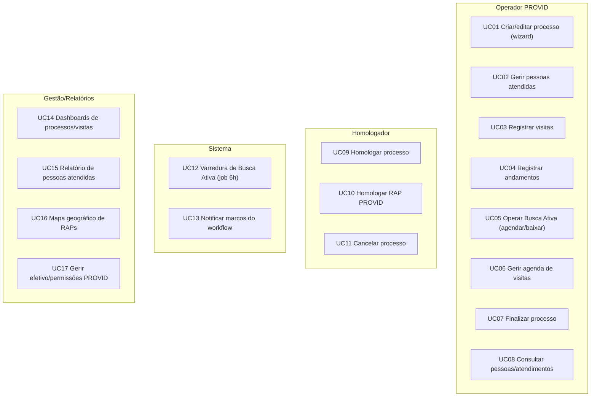

| Caso de uso | Ator | Endpoint legado (referência) | Observação |
|---|---|---|---|
| UC01 Criar/editar processo | Operador | `ProcessoController` (wizard, `Salvar`, `Carregar`) | rascunho único por usuário |
| UC02 Pessoas atendidas | Operador | `PessoaAtendidaProvidController` | cria PF em `Pessoas` se nova |
| UC03 Visitas | Operador | `ProcessoController` / repositório | vinculada a pessoa+processo |
| UC04 Andamentos | Operador | `ProcessoController` | tipos 1–4; tipo 4 pode transferir UPM |
| UC05 Busca Ativa | Operador | `BuscaAtivaProvidController` | agendar visita ou baixar c/ justificativa |
| UC06 Agenda | Operador/Adm | `AgendaProvidController` | vínculo a RAP (TipoId=1) ou Processo (TipoId=2) |
| UC07 Finalizar | Operador | `ProcessoController` transicionar | `EmAndamento→Finalizado` |
| UC08 Consultas | Operador | `ProvidController` `Pessoa`, `Atendimentos` | escopo UPM |
| UC09 Homologar processo | Homologador | transicionar | `Finalizado→Homologado` |
| UC10 Homologar RAP | Homologador | `ProvidController.Homologar` | RAP `IdTipo=6` finalizado |
| UC11 Cancelar processo | Homologador | transicionar | de `EmAndamento`/`Finalizado`/`Homologado` |
| UC12 Varredura | Job | `BuscaAtivaProvidService` | a cada 6h, lote 500 |
| UC13 Notificar | Sistema | `WorkflowEventHandler` | hoje apenas log (stub) |
| UC14 Dashboards | Gestão | `ProvidDashboard*Repository` | filtro por UPM/período |
| UC15 Pessoas atendidas | Gestão | `ProvidRelatorioController` | usa SP `sp_Provid_PessoasResumo` |
| UC16 Mapa | Gestão | `ProvidRelatorioController.MapaDados` | intervalo ≤ 90 dias |
| UC17 Efetivo/permissões | Gestão | `ProvidController.Efetivo`, `RemoverUsuarioDaRole` | via SGPOL + roles |

### 2.4 Jornadas operacionais

**Jornada A — Triagem por Busca Ativa**

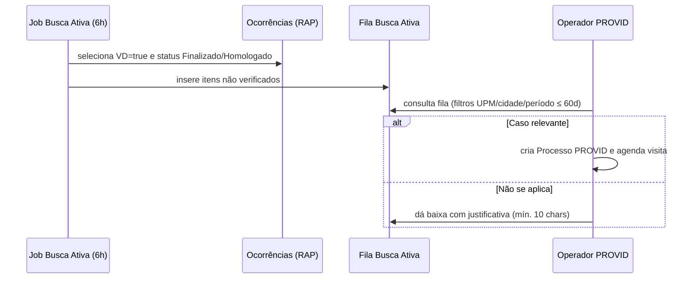

**Jornada B — Ciclo de vida do Processo**

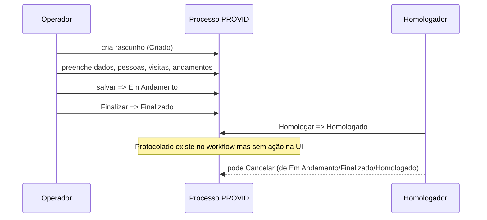

### 2.5 Bounded contexts e mapa de contexto

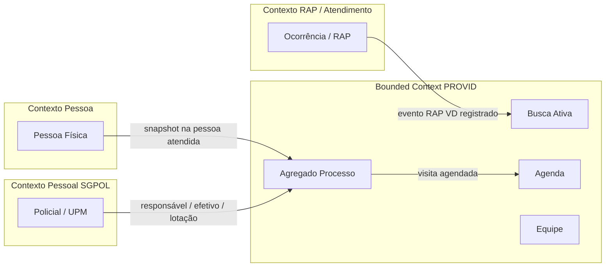

- **Núcleo (core):** Processo PROVID e seu ciclo de vida.
- **Suporte:** Busca Ativa, Agenda, Equipe.
- **Genéricos/externos (upstream):** RAP/Ocorrência, Pessoa Física, Pessoal (SGPOL/UPM) — consumidos via integração, **não** pertencem ao PROVID.

> Relação **RAP ↔ Processo é conceitual/operacional**, não há FK direta entre um processo e um RAP específico no legado. A Busca Ativa e a Agenda criam as pontes.

---

## 3. Regras de Negócio

### 3.1 Máquina de estados do Processo

Status persistidos em `PROVID_PROCESSO.IdStatus` (enum `StatusProcesso`):

| Valor | Estado | Label UI | Cor |
|---|---|---|---|
| 1 | `Criado` | Gerado | Cinza `#6C757D` |
| 2 | `EmAndamento` | Em Andamento | Verde `#28A745` |
| 3 | `Finalizado` | Finalizado | Azul `#2196F3` |
| 4 | `Homologado` | Homologado | Amarelo `#FFC107` |
| 5 | `Protocolado` | Protocolado | Dourado `#FFD700` |
| 6 | `Cancelado` | Cancelado | Vermelho `#DC3545` |

As transições **não são hardcoded**: são data-driven via tabela `PROVID_WORKFLOW_PERMISSAO` (origem × destino × perfil). Seed atual:

| Origem | Destino | Perfil exigido |
|---|---|---|
| Criado | Em Andamento | `Provid` |
| Em Andamento | Finalizado | `Provid` |
| Finalizado | Homologado | `Homologador` |
| Homologado | Protocolado | `Homologador` |
| Criado | Cancelado | `Provid` |
| Em Andamento | Cancelado | `Homologador` |
| Finalizado | Cancelado | `Homologador` |
| Homologado | Cancelado | `Homologador` |

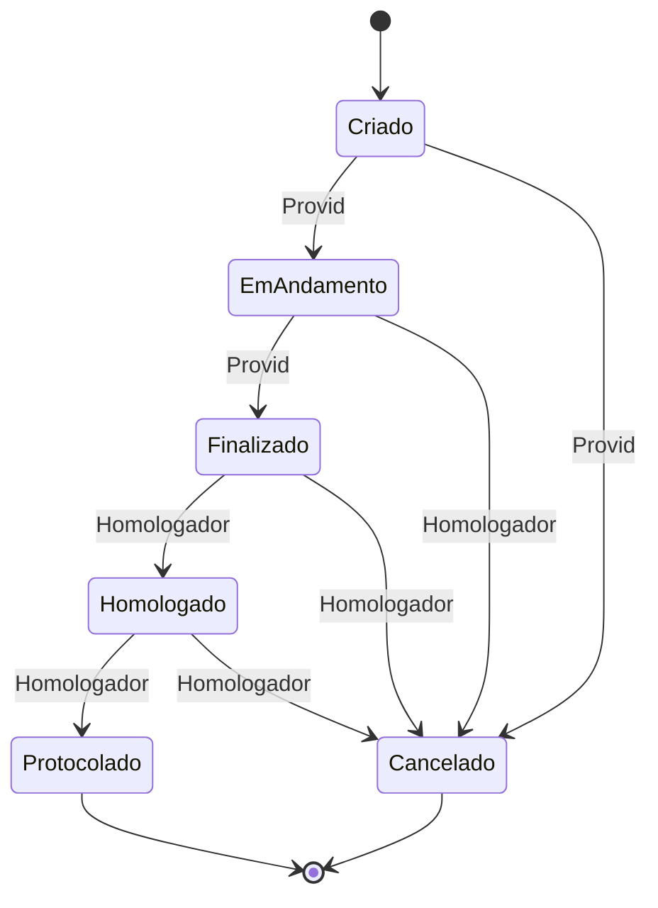

> **Lacuna conhecida:** a transição `Homologado → Protocolado` existe no seed e dispara evento, mas **não há botão na UI**. A UI expõe apenas Finalizar, Homologar e Cancelar.

### 3.2 Invariantes e regras (catálogo)

| ID | Regra | Onde (legado) |
|---|---|---|
| RN01 | Cada usuário tem no máximo **um rascunho** (`Criado`) por vez | `ObterOuCriarProcesso` |
| RN02 | Ao salvar processo existente, status vai para `EmAndamento` + andamento "Processo Atualizado" | `ProcessoController.Salvar` |
| RN03 | Processo `Homologado` **não abre para edição** (HTTP 403) | `ProcessoController.Carregar` |
| RN04 | Remoção de pessoa/visita/andamento **bloqueada** se processo `Finalizado` | `ProvidRepository` |
| RN05 | Remoção de registro só pelo **usuário criador** (`registro.Usuario == usuario`) | `ProvidRepository` |
| RN06 | Numeração gerada no 1º save: `{AAAA}{OOO}{UUUUU}{NNNN}` (ano, origem, UPM, sequencial) | `ProcessoController` / `GerarNumeroProvid` |
| RN07 | Sequência de numeração é **por UPM + ano** | `AppDbContext.GerarNumeroProvid` |
| RN08 | Transição de status valida perfil contra `PROVID_WORKFLOW_PERMISSAO` | `WorkflowService.PodeAvancarAsync` |
| RN09 | Toda transição grava histórico em `PROVID_WORKFLOW` | `ProcessoProvid.AtualizarStatus` |
| RN10 | Pessoa nova cria PF em `Pessoas` (+ endereço, `OrigemCadastro="ATENDIMENTO PROVID"`) e andamento tipo 2 | `PessoaAtendidaProvidController` |
| RN11 | Não permitir a mesma pessoa duplicada no mesmo processo | `verifica/{pessoaId}/processo/{processoId}` |
| RN12 | Andamento tipo 4 pode **transferir o processo de UPM** (se `UpmId > 0`) | `ProcessoController` |
| RN13 | Evento de agenda: `Start <= End` e descrição obrigatória | `AgendaProvidController` |
| RN14 | Exclusão de agenda: criador (`Usuario`) **ou** mesma UPM | `AgendaProvidController` |
| RN15 | Busca Ativa: período máximo de **60 dias** na consulta | `BuscaAtivaProvidController` + JS |
| RN16 | Baixa de Busca Ativa exige justificativa (mín. **10 caracteres**) e marca `Verificado=true` | `BuscaAtivaProvidController` |
| RN17 | Job de Busca Ativa: RAP com `ViolenciaDomestica=true` **e** status ∈ {Finalizado(1), Homologado(2)} **e** ausente de `PROVID_BUSCAATIVA` | `BuscaAtivaProvidService` |
| RN18 | Listagem da Busca Ativa exibe apenas RAPs `IdTipo <= 5` (exclui RAP PROVID tipo 6) | `BuscaAtivaProvidController` |
| RN19 | Homologar RAP PROVID (tipo 6) exige status anterior **Finalizado** e claim `Provid`/`Provid Gestão` | `RapAdminService` |
| RN20 | Relatórios RAP genéricos **excluem** tipo 6 para quem não tem claim PROVID | `RapAdminService` |
| RN21 | Mapa: UPM e datas obrigatórias; sem datas futuras; intervalo ≤ **90 dias** | `ProvidRelatorioController.MapaDados` |
| RN22 | Isolamento por UPM em listagem, abertura, dashboards, relatórios e estatísticas | múltiplos |
| RN23 | `Carregar` retorna 403 se `processo.UpmId != UPM do usuário` | `ProcessoController.Carregar` |
| RN24 | Efetivo PROVID = policiais da UPM com role PROVID (via `SGPOL_VWPolicial` + `aspnet_UsersInRoles`) | `ProvidController.Efetivo` |
| RN25 | `TotalAbertos` em estatísticas conta apenas `EmAndamento` (não inclui `Criado`) | `ProvidAppService` |
| RN26 | Visita validada: data não futura, horários coerentes, desfecho/estabelecimento/natureza | validators |

### 3.3 Validações de Pessoa Atendida

`PessoaEnvolvidaProvidValidator`: nome, CPF válido, nome da mãe, nascimento não futuro, sexo, raça, envolvimento, estado civil, vínculo, filhos, religião, renda, profissão, benefício, turno e endereço.

### 3.4 Dois ciclos de homologação (atenção)

| Conceito | O que homologa | Critério | Perfil |
|---|---|---|---|
| **Homologação de Processo** | `ProcessoProvid` (`Finalizado→Homologado`) | workflow data-driven | `Homologador` |
| **Homologação de RAP PROVID** | `Ocorrencias` tipo 6 finalizado | status anterior = Finalizado | `Provid`/`Provid Gestão` |

São fluxos **distintos** e devem permanecer separados no Nexus.

---

## 4. Modelo de Dados e Dependências

### 4.1 Agregados (visão de domínio)

- **Agregado raiz:** `Processo` (`PROVID_PROCESSO`).
- **Entidades filhas (cascade):** Pessoas Atendidas, Visitas (acompanhamento), Visitas Iniciais, Andamentos, Contextos, Histórico de Workflow.
- **Agregados de apoio (ciclo de vida próprio):** Busca Ativa, Agenda, Equipe.
- **Lookups (`PROVID_*`):** ~17 tabelas de domínio (origem, natureza penal, risco, vínculo, etc.).

> O PROVID **não modela** entidades separadas `Vitima`/`Agressor`/`Dependente`. O papel vem de `PessoaAtendida.EnvolvimentoId → TipoEnvolvimento`; o vínculo com o ofensor de `VinculoId → PROVID_VINCULO`. "Dependentes" são representados por tipos de filhos (`PROVID_FILHO`), não há entidade dependente.

### 4.2 Diagrama entidade-relacionamento (lógico)

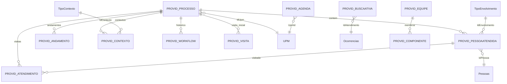

### 4.3 Entidades principais e atributos-chave

**`PROVID_PROCESSO`** (agregado raiz; PK `Id` GUID)

| Atributo | Coluna | Observação |
|---|---|---|
| UPM | `IdUpm` | eixo de isolamento |
| Origem / Natureza / Risco | `IdOrigem` / `IdNatureza` / `IdRisco` | FK lookups |
| Conjugal / Filhos / Sustento / Estado civil | `IdConjugal` / `IdFilhos` / `IdSustento` / `IdEstadoCivil` | FK lookups |
| Encerramento | `IdEncerramento` | FK lookup |
| UF / Cidade | `IdUf` / `IdCidade` | geográficas |
| Status | `IdStatus` | enum 1–6 |
| Número / Numeração | `Numero` / `Numeracao` | sequencial UPM/ano + máscara |
| Flags de violência | `MedidaProtetiva`, `ViolenciaFisica`, ... | bit |
| Responsável / Usuário | `Responsavel` / `Usuario` | matrícula (FK lógica SGPOL) |
| Datas de ciclo | `DataRecebimento`, `DataAbertura`, `DataConclusao`, `DataHomologacao`, `DataCadastro` | |

**`PROVID_PESSOAATENDIDA`** (PK `Id`): `IdProcesso`, `IdPessoa`→`Pessoas`, `IdEnvolvimento`→`TipoEnvolvimento`, `IdVinculoOfensor`→`PROVID_VINCULO`, demografia, snapshot desnormalizado (nome, CPF, mãe, contatos, endereço), flags (`IntegranteSegurancaPublica`, `AcessoArmaFogo`, `Deficiencia`, `Acompanhado`, `Trabalha`), `Usuario`, `DataCadastro`.

**`PROVID_ATENDIMENTO`** (Visita de acompanhamento — nome legado confuso): `IdProcesso`, `IdPessoa`, `IdNatureza`, `IdEstabelecimento`, `IdDesfecho`, `Data`, `HoraChegada`/`HoraSaida`, `Historico`, `Usuario`.

**`PROVID_VISITA`** (Visita inicial/palestra): `IdProcesso`, `IdUpm`, `IdOrigem`, `IdNatureza`, datas/horas, `Palestrante`, `Publico`, `Historico`, `GerarProcesso`, `Usuario`.

**`PROVID_ANDAMENTO`** (trilha funcional): `IdProcesso`, `IdTipo` (1=gerado, 2=alteração, 3=exclusão, 4=manual/transfere UPM), `Descricao`, `Usuario`, `DataCadastro`.

**`PROVID_CONTEXTO`** (N:N): `IdProcesso`, `IdContexto`→`TipoContexto`.

**`PROVID_WORKFLOW`** (histórico): `IdProcesso`, `NovoStatus`, `DataTransicao`, `Usuario`, `Observacao`.
**`PROVID_WORKFLOW_PERMISSAO`**: matriz perfil × origem × destino.

**`PROVID_BUSCAATIVA`** (PK `Id`): `IdAtendimento`→`Ocorrencias.Oco_Id` (FK lógica), `Verificado`, `Usuario`, `Justificativa`, `DataCadastro`, `DiasTranscorridos` (coluna computada `DATEDIFF(day, DataCadastro, GETDATE())`).

**`PROVID_AGENDA`** (PK `Id` int): `UpmId`, `TipoId` (1=ocorrência/RAP, 2=processo), `VinculoId` (string), `StatusId`, `Descricao`, `Cor`, `Inicio`, `Fim`, `Usuario`.

**`PROVID_EQUIPE` / `PROVID_COMPONENTE`**: equipe (UPM, descrição, ativo) 1:N componentes (matrícula).

### 4.4 Lookups `PROVID_*`

`PROVID_BENEFICIO`, `PROVID_CONJUGAL`, `PROVID_DESFECHO`, `PROVID_ENCERRAMENTO`, `PROVID_ESTABELECIMENTO`, `PROVID_FAIXA`, `PROVID_FILHO`, `PROVID_PESSOA`, `PROVID_GRAURISCO`, `PROVID_INFORMACAO`, `PROVID_TIPOPENAL` (+flags Visita/Atendimento/Processo), `PROVID_ORIGEM`, `PROVID_PROFISSAO`, `PROVID_RELIGIAO`, `PROVID_RENDA`, `PROVID_VINCULO`, `PROVID_SUSTENTO`, `PROVID_AGENDA_TIPO`. Todas com flag `Ativo` (desativação lógica de domínio).

### 4.5 Dependências externas (upstream)

| Sistema/Tabela | Uso no PROVID | Estratégia no Nexus |
|---|---|---|
| `Pessoas` + `Pessoas_Enderecos` | cadastro mestre de PF; snapshot na pessoa atendida | consumir contexto **Pessoa** do Nexus (já existe `PessoaEntity`/`PessoaStore`) |
| `Ocorrencias` (RAP) | RAP tipo 6, Busca Ativa (`ViolenciaDomestica`), mapa, homologação | consumir contexto **RAP/Atendimento** do Nexus via evento/REST |
| `TipoEnvolvimento`, `TipoContexto`, `Sexo`, `TipoCutis`, `TipoEstadoCivil` | demografia/papéis | migrar como lookups/enums do PROVID ou referenciar genéricos |
| `Upm`, `Cidade`, `Uf` | lotação e localização | consumir cadastros base do Nexus |
| `SGPOL_VWPolicial`, `SGPOL_VWUpms` | responsável, efetivo, lotação | integração com contexto Pessoal (REST/Strategy) |
| `aspnet_Users`, `aspnet_UsersInRoles` | efetivo com role PROVID | substituir por **roles/claims Keycloak** |
| `sp_Provid_PessoasResumo(@UpmId,@AnoBase)` | relatório de pessoas (RAP envolvidos + PROVID atendidas) | **não está no Git**; extrair do SQL Server e reimplementar como agregação |

### 4.6 Acesso a dados no legado (EF Core vs Dapper)

| Operação | Tecnologia |
|---|---|
| CRUD processo/pessoa/visita/andamento, busca ativa, dashboards, agenda | **EF Core** (LINQ + transações) |
| Efetivos PROVID por UPM | **Dapper** (join `aspnet_UsersInRoles` + `aspnet_Users` + `SGPOL_VWPolicial`) |
| Remover usuário da role | **Dapper** (`DELETE aspnet_UsersInRoles`) |
| Relatório de pessoas | **Stored Procedure** `sp_Provid_PessoasResumo` |

### 4.7 Auditoria, soft-delete e isolamento

- **Auditoria:** padrão `Usuario` (matrícula) + `DataCadastro`; trilha funcional adicional em `PROVID_ANDAMENTO` e `PROVID_WORKFLOW`.
- **Soft-delete:** **não existe** nas entidades transacionais (exclusão física com regras de criador/status). Lookups usam flag `Ativo`.
- **Isolamento por UPM:** presente em entidade (`IdUpm`), autorização (403 em `Carregar`), numeração (sequência por UPM/ano), dashboards, relatórios e estatísticas.

---

## 5. Requisitos Funcionais e Não Funcionais

> Equivalente ao `requirements.md` exigido pelo prompt mestre, em formato de checklist.

### 5.1 Requisitos Funcionais (RF)

**Processo PROVID**
- [ ] RF01 — Criar processo PROVID a partir de rascunho único por usuário.
- [ ] RF02 — Editar processo em wizard (dados → pessoas → visitas → andamentos → encerramento).
- [ ] RF03 — Gerar numeração `{ano}{origem}{UPM}{sequencial}` no primeiro salvamento, sequencial por UPM/ano.
- [ ] RF04 — Transicionar status conforme matriz de workflow data-driven (perfil × origem × destino).
- [ ] RF05 — Registrar histórico de toda transição (status, usuário, data, observação).
- [ ] RF06 — Bloquear edição de processo `Homologado`.
- [ ] RF07 — Finalizar (operador), Homologar/Cancelar (homologador) via UI.
- [ ] RF08 — Suportar transição `Homologado → Protocolado` (corrigir lacuna de UI ou decidir descontinuar).

**Pessoas Atendidas**
- [ ] RF09 — Cadastrar pessoa atendida, criando PF no cadastro mestre quando nova.
- [ ] RF10 — Definir papel (envolvimento) e vínculo com ofensor.
- [ ] RF11 — Impedir pessoa duplicada no mesmo processo.
- [ ] RF12 — Editar/remover pessoa (remoção só pelo criador e não em processo finalizado).
- [ ] RF13 — Registrar andamento automático na inclusão de pessoa.

**Visitas e Andamentos**
- [ ] RF14 — Registrar visita de acompanhamento vinculada a pessoa+processo.
- [ ] RF15 — Registrar visita inicial/palestra (com indicador de gerar processo).
- [ ] RF16 — Registrar andamentos (tipos: gerado, alteração, exclusão, manual).
- [ ] RF17 — Andamento manual poder transferir o processo de UPM.
- [ ] RF18 — Validar visita: data não futura, horários coerentes, desfecho/estabelecimento/natureza.

**Busca Ativa**
- [ ] RF19 — Varredura automática (job) de RAPs de violência doméstica finalizados/homologados ausentes da fila.
- [ ] RF20 — Listar fila com filtros (UPM, cidade, período ≤ 60 dias) exibindo apenas RAPs não-PROVID (tipo ≤ 5).
- [ ] RF21 — Agendar visita a partir de item da fila.
- [ ] RF22 — Dar baixa com justificativa (mín. 10 caracteres), marcando como verificado.
- [ ] RF23 — Exibir dias transcorridos por item.

**Agenda**
- [ ] RF24 — CRUD de eventos vinculados a RAP (tipo 1) ou processo (tipo 2).
- [ ] RF25 — Validar evento (início ≤ fim, descrição obrigatória).
- [ ] RF26 — Mover/recolorir/alterar status de evento (drag-and-drop).
- [ ] RF27 — Excluir evento (criador ou mesma UPM).

**RAP PROVID**
- [ ] RF28 — Listar RAPs PROVID (tipo 6) finalizados aguardando homologação.
- [ ] RF29 — Homologar RAP PROVID (status anterior Finalizado; claim PROVID).
- [ ] RF30 — Excluir RAPs tipo 6 de relatórios genéricos para quem não tem claim PROVID.

**Consultas, Relatórios e Dashboards**
- [ ] RF31 — Pesquisar pessoas com contagem de processos PROVID.
- [ ] RF32 — Listar atendimentos RAP PROVID da UPM.
- [ ] RF33 — Relatório de pessoas atendidas por UPM/ano (reimplementar `sp_Provid_PessoasResumo`).
- [ ] RF34 — Mapa geográfico de RAPs (UPM e datas obrigatórias; sem futuro; ≤ 90 dias).
- [ ] RF35 — Dashboards de processos e de visitas (filtro UPM/período).
- [ ] RF36 — Estatísticas para Copilot/IA escopadas por UPM.

**Efetivo e Permissões**
- [ ] RF37 — Listar efetivo PROVID da UPM.
- [ ] RF38 — Conceder/remover permissão PROVID a policiais (via roles Keycloak).

### 5.2 Requisitos Não Funcionais (RNF)

**Segurança**
- [ ] RNF01 — Autenticação/autorização via Keycloak (OIDC/JWT); substituir `IAspNetUser` por claims JWT.
- [ ] RNF02 — Autorização por roles (`@RolesAllowed`) equivalentes às policies `PROVID`, `HOMOLOGADOR`, `ADMINISTRATIVO`.
- [ ] RNF03 — Isolamento de dados por UPM em todas as consultas, comandos e relatórios.
- [ ] RNF04 — Auditoria e rastreabilidade (quem/quando/o quê) preservadas e ampliadas.
- [ ] RNF05 — Aderência à LGPD (dados sensíveis de vítimas; anonimização para IA).

**Desempenho e escala**
- [ ] RNF06 — Listagens paginadas e indexadas (índices Mongo programáticos).
- [ ] RNF07 — Job de Busca Ativa idempotente e em lote (ex.: 500), tolerante a falhas (retry).
- [ ] RNF08 — Cache (Redis) para lookups e consultas de alta leitura.

**Confiabilidade e operação**
- [ ] RNF09 — Eventos de domínio publicados de forma confiável (RabbitMQ) com reprocessamento.
- [ ] RNF10 — Observabilidade: métricas (Micrometer/Prometheus), health checks, logs estruturados.
- [ ] RNF11 — Migração com dual-run e reconciliação antes do corte.

**Manutenibilidade**
- [ ] RNF12 — Arquitetura hexagonal aderente ao padrão `nexus-backend`.
- [ ] RNF13 — Frontend Angular 17 standalone aderente ao padrão `nexus-frontend` (Vex/Material/Tailwind).
- [ ] RNF14 — Regras de negócio no core (sem regras hardcoded em UI, como menu por UPM 25/10034).
- [ ] RNF15 — Contratos REST versionados (`/api/v1/provid`) e documentados (OpenAPI/Swagger).

---

## 6. Análise de Riscos de Migração

> Equivalente ao `analise_riscos.md`. Escala: Probabilidade (P) e Impacto (I) — Baixo/Médio/Alto.

| ID | Risco | P | I | Mitigação |
|---|---|---|---|---|
| RM01 | **Stored Procedure ausente** (`sp_Provid_PessoasResumo` fora do Git) | Alta | Alto | Extrair definição do SQL Server; reimplementar como agregação Mongo; testar paridade de números |
| RM02 | **Remodelagem relacional → documento** introduz divergência semântica | Média | Alto | Desenhar agregados com base nas invariantes; revisão por especialista de domínio; dual-run |
| RM03 | **Dois fluxos de homologação** (Processo vs RAP) confundidos | Média | Médio | Manter contextos separados; nomear claramente; testes distintos |
| RM04 | **Dois conceitos de "visita"** (`PROVID_ATENDIMENTO` vs `PROVID_VISITA`) | Média | Médio | Renomear no domínio (Visita de Acompanhamento vs Visita Inicial); documentar De→Para |
| RM05 | **Dependência de views SGPOL** (`SGPOL_VWPolicial`) | Alta | Alto | Definir integração (REST/Strategy) com contexto Pessoal; contrato estável |
| RM06 | **Roles em `aspnet_*`** divergem do Keycloak | Alta | Médio | Mapear roles legados → roles/grupos Keycloak; script de provisionamento |
| RM07 | **Snapshot desnormalizado** de pessoa pode divergir do cadastro mestre | Média | Médio | Política de sincronização; definir fonte da verdade por campo |
| RM08 | **Numeração sequencial por UPM/ano** com concorrência | Média | Alto | Geração atômica (contador transacional/coleção dedicada); testes de concorrência |
| RM09 | **Regras de piloto hardcoded** (menu UPM 25/10034) | Baixa | Médio | Externalizar como feature flag/config; não replicar hardcode |
| RM10 | **Notificações são stub** (apenas log) | Alta | Baixo | Implementar de fato via eventos + serviço de notificação, ou registrar como débito explícito |
| RM11 | **`Protocolado` sem UI** | Média | Baixo | Decidir manter/expor/descontinuar; alinhar com negócio |
| RM12 | **`EquipesController` comentado** (equipes não operacionais) | Média | Baixo | Confirmar se entra no escopo; migrar dados só se houver uso |
| RM13 | **Perda de histórico/auditoria** na migração | Média | Alto | Migrar `PROVID_ANDAMENTO` e `PROVID_WORKFLOW` integralmente; validar contagens |
| RM14 | **Volume e janela de corte** (downtime) | Média | Médio | ETL incremental + dual-run; corte em janela controlada |
| RM15 | **Dados sensíveis (LGPD)** expostos indevidamente | Baixa | Alto | Criptografia em repouso, mascaramento em logs, controle de acesso fino, anonimização p/ IA |
| RM16 | **Acoplamento a `Pessoas`/`Ocorrencias`** compartilhados | Alta | Médio | Consumir contextos Pessoa e RAP do Nexus via API/eventos, sem acesso direto ao SQL legado |
| RM17 | **Computed column `DiasTranscorridos`** | Baixa | Baixo | Calcular em tempo de leitura no serviço |
| RM18 | **Inconsistência de comentários/labels de status** no legado | Baixa | Baixo | Usar enum canônico (1–6) como fonte da verdade |

---

## 7. Proposta Arquitetural Nexus

### 7.1 C4 — Contexto (nível 1)

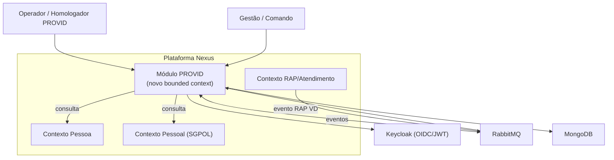

### 7.2 C4 — Contêineres (nível 2)

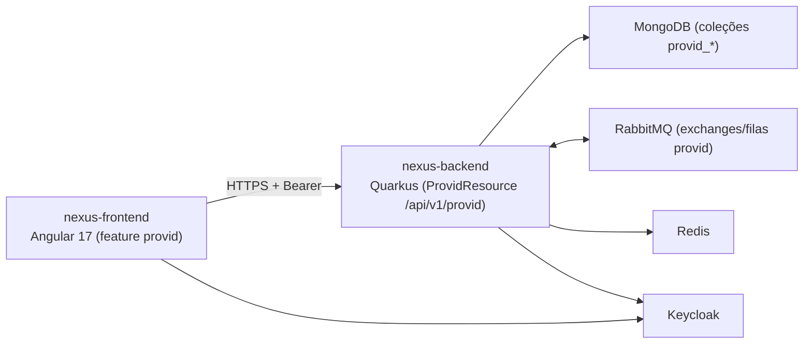

### 7.3 Arquitetura hexagonal (componentes do módulo)

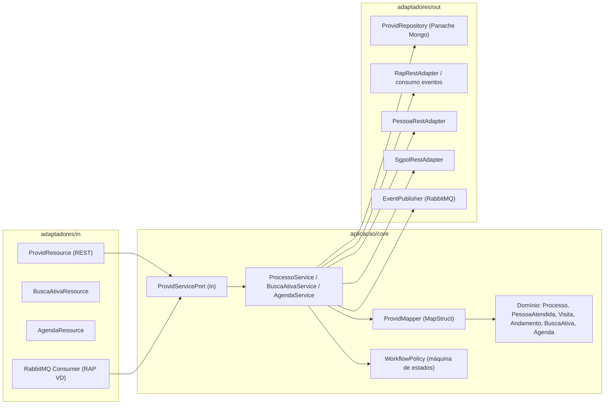

### 7.4 Bounded contexts e agregados

| Agregado | Raiz | Conteúdo (coleção/embed) | Invariantes-chave |
|---|---|---|---|
| **Processo** | `Processo` | pessoas atendidas, visitas, andamentos, contextos, histórico de workflow (embed ou coleções referenciadas) | RN01–RN09, RN22–RN25 |
| **BuscaAtiva** | `ItemBuscaAtiva` | referência ao RAP, status de verificação, justificativa | RN15–RN18 |
| **Agenda** | `EventoAgenda` | vínculo (RAP/Processo), período, status | RN13–RN14 |
| **Equipe** | `Equipe` | componentes (matrículas) | — |

> **Decisão de modelagem (MongoDB):** o agregado `Processo` favorece **embedding** de pessoas/visitas/andamentos/contextos/histórico (lidos sempre no contexto do processo, fronteira transacional natural). Busca Ativa, Agenda e Equipe são **coleções próprias** (ciclos de vida independentes). Avaliar limite de 16MB/documento; processos com muitas visitas podem migrar visitas para coleção referenciada.

### 7.5 Blueprint de pacotes — backend (`nexus-backend`)

```
br.gov.df
├── aplicacao/core/domain/provid/
│   ├── Processo.java
│   ├── PessoaAtendida.java
│   ├── VisitaAcompanhamento.java
│   ├── VisitaInicial.java
│   ├── Andamento.java
│   ├── ItemBuscaAtiva.java
│   ├── EventoAgenda.java
│   └── enums/  (StatusProcesso, TipoAndamento, TipoEnvolvimento...)
├── aplicacao/core/service/
│   ├── ProcessoService.java          @ApplicationScoped implements ProcessoServicePort
│   ├── BuscaAtivaService.java
│   ├── AgendaService.java
│   └── ProvidWorkflowPolicy.java     (máquina de estados data-driven)
├── aplicacao/core/mapper/
│   └── ProvidMapper.java             @Mapper(componentModel = "jakarta-cdi")
├── aplicacao/ports/in/
│   ├── ProcessoServicePort.java
│   ├── BuscaAtivaServicePort.java
│   └── AgendaServicePort.java
├── aplicacao/ports/out/
│   ├── ProcessoRepositoryPort.java
│   ├── BuscaAtivaRepositoryPort.java
│   ├── AgendaRepositoryPort.java
│   ├── RapConsultaPort.java
│   ├── PessoaConsultaPort.java
│   ├── PessoalSgpolPort.java
│   └── ProvidEventPublisherPort.java
├── adaptadores/in/
│   ├── ProvidProcessoResource.java   @Path("/v1/provid/processos")
│   ├── ProvidBuscaAtivaResource.java @Path("/v1/provid/busca-ativa")
│   ├── ProvidAgendaResource.java     @Path("/v1/provid/agenda")
│   ├── dto/provid/  (ProcessoRequestDTO, ProcessoResponseDTO, ...)
│   └── queue/ProvidRapConsumer.java  (consome evento RAP VD)
├── adaptadores/out/
│   ├── repository/ (ProcessoRepository, BuscaAtivaRepository, AgendaRepository — Panache Mongo)
│   ├── rest/ (RapApiRest, PessoaApiRest, SgpolApiRest — MP Rest Client)
│   ├── (RapRestAdapter, PessoaRestAdapter, SgpolRestAdapter, ProvidEventPublisher)
└── adaptadores/infraestrutura/
    └── mongoindex/  (índices provid_processos por upm/status/numero...)
```

Convenções a seguir (do `nexus-backend`): `@RolesAllowed({"app.nexus.acesso","default-roles-pmdf", ...})`, lançar `NexusException`/`ListBusinessException`, métricas automáticas via handlers existentes, root path `/api`.

### 7.6 Blueprint de feature — frontend (`nexus-frontend`)

```
features/provid/
├── provid.routes.ts                 # lazy loadComponent + AuthGuard
├── processo/
│   ├── components/ (lista, wizard, detalhe)
│   ├── model/ (processo.model.ts, pessoa-atendida.model.ts...)
│   └── services/ (processo.service.ts → ${environment.apiNexus}/v1/provid/processos)
├── busca-ativa/
├── agenda/                          # angular-calendar
└── dashboards/                      # ng-apexcharts
```

Padrão: componentes **standalone** (`selector: 'nexus-provid-*'`), `ChangeDetectionStrategy.OnPush`, Angular Material + Tailwind + Vex, `MatTable` para listas, ApexCharts para dashboards, estado via service com `BehaviorSubject`/Signals (sem NgRx).

### 7.7 Contratos REST propostos (`/api/v1/provid`)

| Método | Rota | Descrição | Role |
|---|---|---|---|
| POST | `/processos` | Cria processo (rascunho) | PROVID |
| GET | `/processos` | Lista processos da UPM (paginado/filtros) | PROVID |
| GET | `/processos/{id}` | Detalhe (403 se outra UPM) | PROVID |
| PUT | `/processos/{id}` | Atualiza (=> Em Andamento) | PROVID |
| POST | `/processos/{id}/transicoes` | Transiciona status (valida workflow) | PROVID/HOMOLOGADOR |
| GET | `/processos/{id}/historico` | Histórico de workflow | PROVID |
| POST | `/processos/{id}/pessoas` | Adiciona pessoa atendida | PROVID |
| PUT/DELETE | `/processos/{id}/pessoas/{pid}` | Edita/remove pessoa | PROVID |
| POST | `/processos/{id}/visitas` | Registra visita | PROVID |
| POST | `/processos/{id}/andamentos` | Registra andamento | PROVID |
| GET | `/busca-ativa` | Lista fila (filtros, ≤ 60d) | PROVID |
| POST | `/busca-ativa/{id}/baixa` | Baixa com justificativa | PROVID |
| GET | `/agenda` | Eventos por UPM/período | PROVID/ADM |
| POST/PUT/DELETE | `/agenda/{id}` | CRUD evento | PROVID |
| GET | `/raps/homologacao` | RAPs PROVID finalizados | HOMOLOGADOR |
| POST | `/raps/{id}/homologacao` | Homologa RAP PROVID | HOMOLOGADOR |
| GET | `/relatorios/pessoas-atendidas` | Relatório por UPM/ano | PROVID |
| GET | `/dashboards/processos` · `/dashboards/visitas` | Painéis | PROVID |
| GET | `/efetivo` | Efetivo PROVID da UPM | PROVID |

> Toda rota aplica **filtro implícito por UPM** a partir das claims JWT (claim de lotação), substituindo `ObterUserOrgaoId()`.

---

## 8. Estratégia Event-Driven

### 8.1 Eventos de domínio (catálogo)

| Evento | Disparado quando | Payload essencial | Consumidores |
|---|---|---|---|
| `provid.processo.criado` | rascunho confirmado/salvo | processoId, upm, usuário, numeração | auditoria, dashboards |
| `provid.processo.finalizado` | `Em Andamento → Finalizado` | processoId, upm, data | fila de homologação, notificação |
| `provid.processo.homologado` | `Finalizado → Homologado` | processoId, upm, homologador | notificação, dashboards |
| `provid.processo.protocolado` | `Homologado → Protocolado` | processoId | notificação |
| `provid.processo.cancelado` | qualquer → Cancelado | processoId, motivo | notificação, dashboards |
| `provid.visita.registrada` | visita de acompanhamento criada | processoId, pessoaId, data | dashboards de visitas |
| `provid.buscaativa.baixada` | baixa com justificativa | itemId, rapId, usuário | auditoria |
| `rap.violenciadomestica.registrado` | RAP VD finalizado/homologado (origem RAP) | rapId, upm, dados | **alimenta Busca Ativa** |

### 8.2 Fluxo orientado a eventos (Busca Ativa)

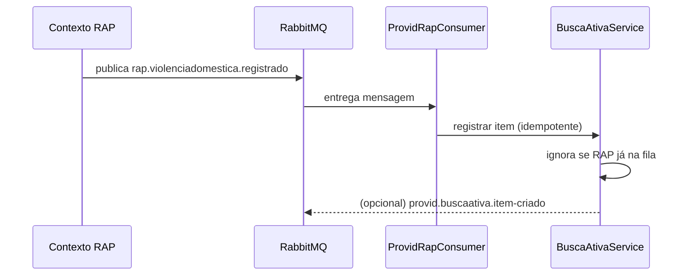

> **Modernização:** o job legado de 6h pode ser **substituído por consumo de evento** `rap.violenciadomestica.registrado` (near-real-time). Manter um **job de reconciliação** periódico como rede de segurança (idempotente) para capturar RAPs perdidos.

### 8.3 Padrões de mensageria

- **Outbox/idempotência:** publicar eventos com chave idempotente (processoId + tipo + versão); consumidores idempotentes.
- **Reprocessamento:** DLQ (dead-letter queue) para mensagens com falha; retry com backoff (alinhar à SmallRye Fault Tolerance já presente).
- **Contrato:** payloads versionados; envelope com `eventId`, `occurredAt`, `upm`, `actor`.

---

## 9. Plano de Migração

### 9.1 Princípio

Migrar **domínio**, não código. O legado é fonte de conhecimento. A transição usa **dual-run** (Genesis e Nexus operando em paralelo durante validação) e **backfill ETL** relacional (SQL Server) → documento (MongoDB), com reconciliação antes do corte.

### 9.2 Ondas

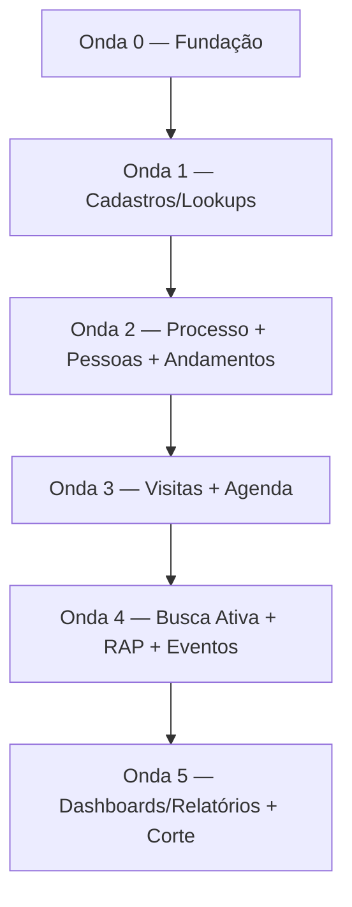

| Onda | Entregas | Critério de saída |
|---|---|---|
| **0 — Fundação** | Bounded context PROVID criado; pacotes hexagonais; segurança Keycloak (roles); contratos OpenAPI; índices Mongo; pipeline de eventos | Endpoint "health" do módulo + autenticação por role funcionando |
| **1 — Cadastros/Lookups** | Migrar 17 lookups `PROVID_*`; integrar contextos Pessoa, RAP, Pessoal/SGPOL | Lookups disponíveis via API; integrações validadas |
| **2 — Processo** | Agregado `Processo` + pessoas atendidas + andamentos + workflow (máquina de estados data-driven); numeração por UPM/ano | CRUD + transições + numeração com paridade ao legado |
| **3 — Visitas + Agenda** | Visita de acompanhamento, visita inicial, agenda (RAP/Processo) | Telas e validações equivalentes |
| **4 — Busca Ativa + RAP + Eventos** | Consumo de `rap.violenciadomestica.registrado` + job de reconciliação; homologação de RAP tipo 6; eventos de processo | Fila populada por evento + reconciliação; homologação RAP funcional |
| **5 — Dashboards/Relatórios + Corte** | Dashboards processos/visitas, relatório de pessoas (reimplementar SP), mapa; corte e desligamento do legado | Reconciliação OK; aprovação de homologação; corte |

### 9.3 Estratégia de dados (relacional → documento)

| Origem (SQL Server) | Destino (MongoDB) | Estratégia |
|---|---|---|
| `PROVID_PROCESSO` | coleção `provid_processos` (raiz) | 1 doc por processo |
| `PROVID_PESSOAATENDIDA` | embed `pessoas[]` no processo | desnormalização preservada |
| `PROVID_ATENDIMENTO` (visitas) | embed `visitas[]` (ou coleção se volumoso) | avaliar limite 16MB |
| `PROVID_VISITA` (inicial) | embed `visitasIniciais[]` | |
| `PROVID_ANDAMENTO` | embed `andamentos[]` | trilha preservada |
| `PROVID_CONTEXTO` | embed `contextos[]` (ids) | |
| `PROVID_WORKFLOW` | embed `historicoWorkflow[]` | |
| `PROVID_WORKFLOW_PERMISSAO` | coleção `provid_workflow_permissoes` | data-driven |
| `PROVID_BUSCAATIVA` | coleção `provid_busca_ativa` | referencia rapId |
| `PROVID_AGENDA` | coleção `provid_agenda` | |
| `PROVID_EQUIPE`/`PROVID_COMPONENTE` | coleção `provid_equipes` (componentes embed) | |
| `PROVID_*` (lookups) | coleções `provid_lookup_*` ou config | flag `ativo` |
| `sp_Provid_PessoasResumo` | agregação Mongo / pipeline | reimplementar lógica |

**Passos do ETL:**
1. Extrair definição da SP `sp_Provid_PessoasResumo` no SQL Server (não está no Git).
2. Construir extratores por tabela; mapear De→Para (Apêndice 13.2).
3. Resolver chaves: `Id` GUID → `_id` (String/ObjectId); FKs de matrícula (`Responsavel`/`Usuario`) preservadas como identificador do policial.
4. Calcular campos derivados em leitura (ex.: `DiasTranscorridos`).
5. Migrar histórico (`PROVID_ANDAMENTO`, `PROVID_WORKFLOW`) integralmente.
6. Reconciliar: contagens por status/UPM/ano; amostragem de processos; somatórios de dashboards.

### 9.4 Numeração concorrente

Substituir `MAX(Numero)+1` por **contador atômico** (coleção `provid_sequencias` com chave `{upm, ano}` e `findAndModify`/`$inc`) para evitar colisão sob concorrência (RM08).

### 9.5 Corte (cutover)

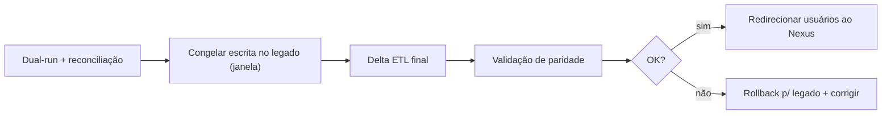

---

## 10. Estratégia de Testes

| Nível | Foco | Ferramentas/Notas |
|---|---|---|
| **Unitário** | Invariantes do domínio (RN01–RN26), `ProvidWorkflowPolicy`, numeração | JUnit 5; cobertura alta no core |
| **Mapeamento** | MapStruct entity↔DTO | testes de mapper |
| **Integração** | Repositórios Panache Mongo, índices | Quarkus Test + Testcontainers (Mongo) |
| **Contrato/API** | `/api/v1/provid/*`, autorização por role, filtro UPM | RestAssured; casos 200/400/403/404 |
| **Mensageria** | consumo `rap.violenciadomestica.registrado`, idempotência, DLQ | Testcontainers (RabbitMQ) |
| **Migração/ETL** | paridade relacional×documento (contagens, somatórios, amostras) | scripts de reconciliação |
| **E2E (frontend)** | jornadas A e B, wizard, busca ativa, agenda | Cypress/Playwright |
| **Não funcionais** | carga em listagens/dashboards, concorrência de numeração, segurança | k6/JMeter; testes de concorrência |
| **Regressão de negócio** | comparação Genesis×Nexus em casos reais (dual-run) | roteiros de homologação |

Casos críticos obrigatórios:
- [ ] Transições válidas/ inválidas por perfil (matriz workflow).
- [ ] Numeração única sob concorrência por UPM/ano.
- [ ] Isolamento por UPM (403 ao acessar processo de outra UPM).
- [ ] Baixa de Busca Ativa exige justificativa ≥ 10 chars.
- [ ] Job/evento de Busca Ativa idempotente (sem duplicar item).
- [ ] Homologação de RAP tipo 6 exige status Finalizado + claim PROVID.
- [ ] Bloqueio de edição/remoção em processo Finalizado/Homologado.

---

## 11. Estratégia de Observabilidade

> Alinhada ao que já existe no `nexus-backend`: **Micrometer + Prometheus** (`/q/metrics`), **SmallRye Health** (`/q/health`), métricas custom `NexusHttpErrorMetrics`. (OpenTelemetry do prompt não está presente; pode ser adotado futuramente.)

**Métricas de negócio (sugeridas):**
- `provid_processos_total{upm,status}` — contagem por status/UPM.
- `provid_transicoes_total{origem,destino,perfil}` — transições de workflow.
- `provid_busca_ativa_pendentes{upm}` — itens não verificados.
- `provid_busca_ativa_dias` — distribuição de dias transcorridos.
- `provid_visitas_total{upm}` — visitas registradas.
- `provid_eventos_publicados_total{tipo}` / `provid_eventos_consumidos_total{tipo,resultado}`.

**Métricas técnicas:** reuso do contador `nexus_http_errors_total` (tags method/endpoint/status/exception/error_class) via handlers existentes.

**Health checks:** liveness/readiness (Mongo, RabbitMQ, dependências REST RAP/Pessoa/SGPOL).

**Logs:** estruturados, com `upm`, `processoId`, `actor`, `correlationId`; **sem PII sensível em claro** (LGPD) — mascarar CPF/nome.

**Rastreabilidade funcional:** preservar trilha via `andamentos[]` e `historicoWorkflow[]` + eventos publicados.

---

## 12. Checklist de Homologação

**Funcional**
- [ ] Wizard do processo completo (dados → pessoas → visitas → andamentos → encerramento).
- [ ] Numeração gerada corretamente (formato e sequência por UPM/ano).
- [ ] Transições de status conforme matriz (Finalizar/Homologar/Cancelar) e perfis.
- [ ] Bloqueios de edição/remoção (processo Finalizado/Homologado; só criador remove).
- [ ] Pessoa atendida: criação de PF nova, papel/vínculo, anti-duplicidade, andamento automático.
- [ ] Visitas (acompanhamento e inicial) com validações.
- [ ] Busca Ativa: fila populada (evento + reconciliação), filtros (≤ 60d), agendar e baixar.
- [ ] Agenda: CRUD, validações, vínculo RAP/Processo, permissão de exclusão.
- [ ] RAP PROVID: listagem e homologação (status Finalizado + claim).
- [ ] Relatórios: pessoas atendidas (paridade com SP), mapa (≤ 90d), dashboards.
- [ ] Efetivo/permissões via roles Keycloak.

**Não funcional**
- [ ] Autenticação/autorização Keycloak por role.
- [ ] Isolamento por UPM em todas as telas/endpoints.
- [ ] Auditoria/rastreabilidade preservadas.
- [ ] Métricas e health checks ativos.
- [ ] LGPD: dados sensíveis protegidos/mascarados.

**Migração de dados**
- [ ] Contagens por status/UPM/ano conferem (legado × Nexus).
- [ ] Histórico (andamentos/workflow) migrado integralmente.
- [ ] Amostragem de processos validada por usuário de negócio.
- [ ] SP `sp_Provid_PessoasResumo` reimplementada com paridade numérica.
- [ ] Reconciliação final aprovada antes do corte.

---

## 13. Apêndices

### 13.1 Mapeamento de status (enum canônico)

| Valor | Enum | Label | Cor | Observação |
|---|---|---|---|---|
| 1 | `Criado` | Gerado | `#6C757D` | rascunho |
| 2 | `EmAndamento` | Em Andamento | `#28A745` | conta em `TotalAbertos` |
| 3 | `Finalizado` | Finalizado | `#2196F3` | bloqueia remoções |
| 4 | `Homologado` | Homologado | `#FFC107` | bloqueia edição |
| 5 | `Protocolado` | Protocolado | `#FFD700` | sem ação na UI legada |
| 6 | `Cancelado` | Cancelado | `#DC3545` | estado terminal |

> A fonte da verdade é o **enum** (`StatusProcesso`), não os comentários numéricos de `StatusProcessoProvid.cs` (desatualizados no legado).

### 13.2 Mapa De→Para de tabelas (SQL Server → MongoDB)

| Tabela legada | Destino Nexus | Tipo |
|---|---|---|
| `PROVID_PROCESSO` | `provid_processos` | coleção (raiz) |
| `PROVID_PESSOAATENDIDA` | `provid_processos.pessoas[]` | embed |
| `PROVID_ATENDIMENTO` | `provid_processos.visitas[]` | embed (ou coleção) |
| `PROVID_VISITA` | `provid_processos.visitasIniciais[]` | embed |
| `PROVID_ANDAMENTO` | `provid_processos.andamentos[]` | embed |
| `PROVID_CONTEXTO` | `provid_processos.contextos[]` | embed |
| `PROVID_WORKFLOW` | `provid_processos.historicoWorkflow[]` | embed |
| `PROVID_WORKFLOW_PERMISSAO` | `provid_workflow_permissoes` | coleção |
| `PROVID_BUSCAATIVA` | `provid_busca_ativa` | coleção |
| `PROVID_AGENDA` | `provid_agenda` | coleção |
| `PROVID_EQUIPE` | `provid_equipes` | coleção |
| `PROVID_COMPONENTE` | `provid_equipes.componentes[]` | embed |
| `PROVID_*` (17 lookups) | `provid_lookup_*` | coleção/config |
| `sp_Provid_PessoasResumo` | pipeline de agregação | lógica |

> **Recomendação de nomenclatura:** aproveitar a migração para nomes de domínio claros em português (ex.: `VisitaAcompanhamento` vs `VisitaInicial`), eliminando a ambiguidade do legado (`PROVID_ATENDIMENTO` que não é RAP).

### 13.3 Mapeamento de papéis (autorização)

| Policy legada (ASP.NET) | Claim/Role Keycloak (alvo) | Capacidade |
|---|---|---|
| `PROVID` (`Provid`/`Provid Gestão`) | role `app.nexus.provid` | operar módulo |
| `HOMOLOGADOR` | role `app.nexus.provid.homologador` | homologar/cancelar |
| `ADMINISTRATIVO` | role `app.nexus.provid.administrativo` | agenda |
| `ObterUserOrgaoId()` (IAspNetUser) | claim de lotação (UPM) no JWT | filtro por UPM |

> Nomes de roles são sugestões; alinhar com a convenção real do realm Keycloak da PMDF.

### 13.4 Lacunas e dívidas conhecidas no legado (decidir destino)

| Item | Situação no Genesis | Recomendação |
|---|---|---|
| `Protocolado → ` | transição existe no seed/evento, **sem botão na UI** | Decidir com negócio: expor, automatizar ou descontinuar |
| Notificações de workflow | **stub** (apenas `log`) | Implementar via eventos + serviço de notificação |
| `EquipesController` | **comentado** (não operacional) | Confirmar uso antes de migrar dados/feature |
| Menu Processo | restrito a UPM `25`/`10034` (piloto) **hardcoded em view** | Externalizar como feature flag/config |
| `TotalAbertos` | conta só `EmAndamento` (ignora `Criado`) | Validar definição de "aberto" com negócio |
| Busca Ativa | job importa todos VD, mas lista só `IdTipo ≤ 5` | Confirmar regra e tornar explícita |
| Comentários de status | numeração desatualizada em `StatusProcessoProvid.cs` | Usar enum canônico |

### 13.5 Mapa de arquivos legados de referência (somente leitura)

| Caminho (Genesis) | Papel |
|---|---|
| `Controllers/Provid/ProcessoController.cs` | wizard, save, transições, numeração |
| `Controllers/Provid/ProcessosController.cs` | pesquisa de processos |
| `Controllers/Provid/PessoaAtendidaProvidController.cs` | pessoas atendidas |
| `Controllers/Provid/AgendaProvidController.cs` | agenda |
| `Controllers/Provid/ProvidRelatorioController.cs` | relatórios/mapa |
| `Controllers/Provid/BuscaAtivaProvidController.cs` | busca ativa |
| `Services/Provid/WorkflowService.cs` | máquina de estados data-driven |
| `Services/Provid/ProvidAppService.cs` | estatísticas/Copilot |
| `Services/BackgroundService/ProcessaBuscaAtivaProvid.cs` | job de busca ativa |
| `Services/Rap/RapAdminService.cs` | regras RAP tipo 6 |
| `Handlers/ProvidWorkflowEventHandler.cs` | eventos pós-transição (stub) |
| `Data/Repository/Provid*Repository.cs` | persistência (EF Core/Dapper) |
| `Data/Mappings/ProvidMapping.cs`, `AuxiliarMapping.cs` | mapeamentos EF |
| `Configuration/DbSeeder.cs` | seed do workflow |
| `Configuration/KeycloakConfig.cs` | policies |
| `buildingBlocks/Genesis.WebAPI.Core/Enum/TipoStatusProcessoProvid.cs` | enum de status |
| `buildingBlocks/Genesis.Abstractions/Dto/Provid*Dto.cs` | DTOs |

### 13.6 Referências do destino (Nexus)

| Caminho (Nexus) | Uso como referência de padrão |
|---|---|
| `nexus-backend/src/main/java/br/gov/df/adaptadores/in/ServicoResource.java` | padrão de Resource JAX-RS |
| `.../aplicacao/core/service/` (ex.: `ServicoService`) | padrão de service `@ApplicationScoped` |
| `.../aplicacao/core/mapper/ServicoNexusMapper.java` | padrão MapStruct `jakarta-cdi` |
| `.../adaptadores/out/repository/VeiculoRepository.java` | padrão Panache Mongo |
| `.../adaptadores/infraestrutura/observability/NexusHttpErrorMetrics.java` | métricas |
| `.../adaptadores/infraestrutura/exception/handler/` | tratamento de exceções |
| `.../adaptadores/in/queue/RabbitMQConsumer.java` | consumo RabbitMQ |
| `nexus-frontend/src/app/features/servico-policial/servico/` | padrão de feature Angular |
| `nexus-frontend/src/app/features/pesquisas/pessoa/services/pessoa.store.ts` | padrão de store com Signals |
| `nexus-web/docs/features/provid/` | documentação PROVID já existente (consultar contratos) |

---

*Fim do documento. Este artefato é uma análise para subsidiar a migração; nenhuma alteração foi feita nos repositórios Genesis ou Nexus.*
