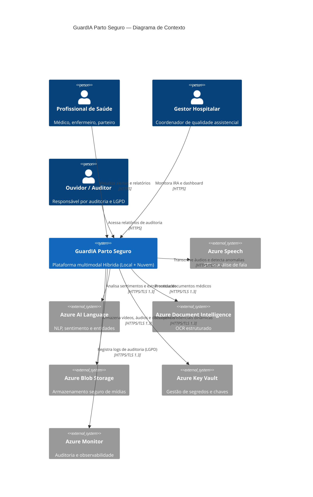
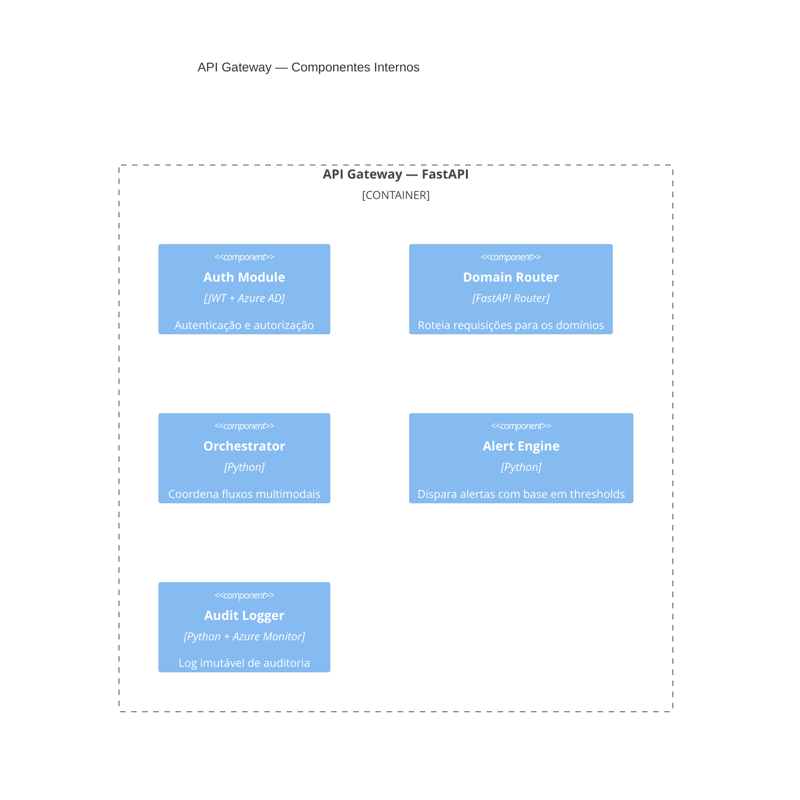
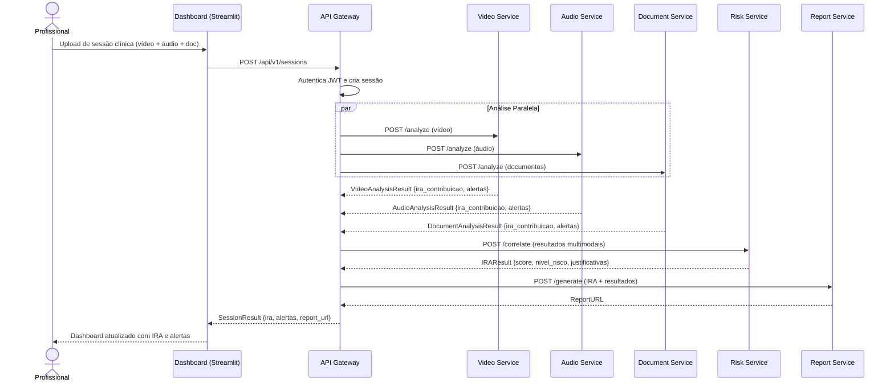
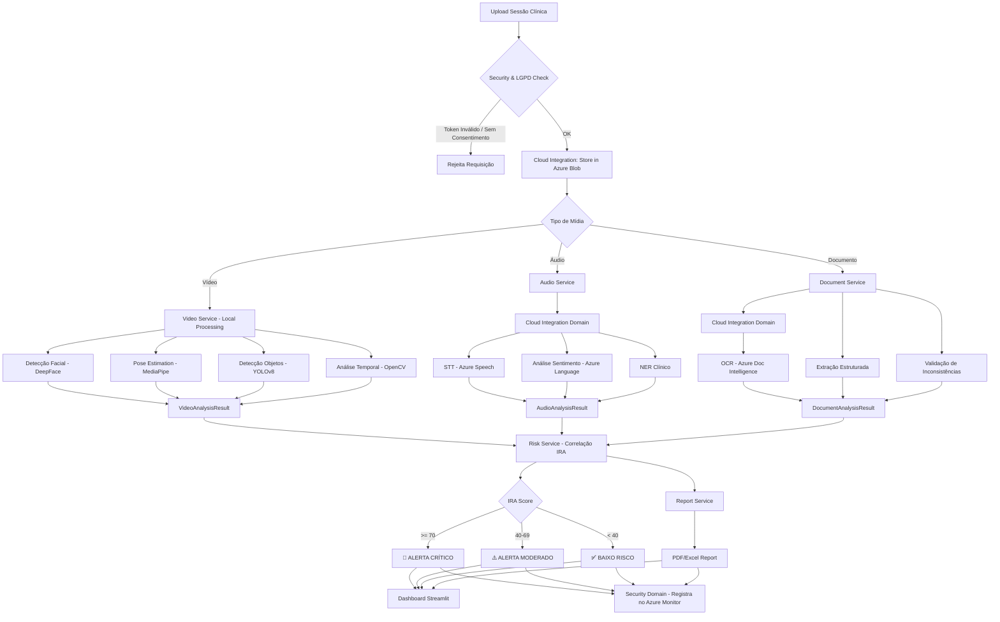
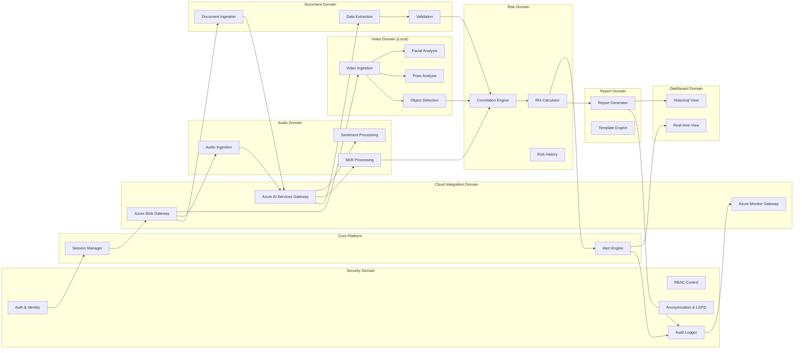

# ARCHITECTURE.md — GuardIA Parto Seguro

> Documento de Arquitetura de Software — Versão 1.0  
> Classificação: Acadêmico — FIAP Tech Challenge

---

## 1. Visão Executiva

### 1.1 Business Case

O Brasil registra altos índices de violência obstétrica e mortalidade materna, muitas vezes associados à ausência de sistemas de vigilância assistencial em tempo real. O **GuardIA Parto Seguro** propõe uma plataforma de IA multimodal capaz de processar simultaneamente vídeo, áudio, documentos e histórico clínico, gerando alertas preventivos e relatórios especializados para equipes de saúde, gestores e ouvidorias.

**Impacto esperado:**
- Redução de 40% nos casos não reportados de violência obstétrica
- Detecção precoce de depressão pós-parto em até 72h após o parto
- Auditoria assistencial automatizada com IRA (Índice de Risco Assistencial)

### 1.2 Problema

- Ausência de vigilância contínua no ambiente obstétrico
- Subnotificação de violência obstétrica e doméstica
- Diagnóstico tardio de depressão pós-parto
- Falta de rastreabilidade em procedimentos clínicos
- Sobrecarga dos profissionais de saúde em registro manual

### 1.3 Objetivos

1. Detectar automaticamente indicadores de violência obstétrica via análise de vídeo e áudio
2. Monitorar sinais de sofrimento psicológico e depressão pós-parto
3. Analisar documentos médicos para detectar inconsistências e riscos
4. Correlacionar múltiplas fontes de dados para calcular o IRA
5. Gerar relatórios e alertas acionáveis para equipes de saúde
6. Fornecer dashboard multimodal em tempo quase real

### 1.4 Escopo

**Dentro do escopo:**
- Análise de vídeo clínico (câmeras de sala de parto e consulta)
- Análise de áudio de consultas (com consentimento)
- Processamento de documentos médicos (prontuários, exames)
- Cálculo do IRA com base em múltiplas fontes
- Dashboard de monitoramento em tempo real
- Sistema de alertas e notificações
- Geração de relatórios especializados

**Fora do escopo:**
- Diagnóstico médico definitivo (sistema é de apoio à decisão)
- Integração com sistemas HIS/RES hospitalares legados (v1.0)
- Aplicativo mobile
- Telemedicina em tempo real

---

## 2. Princípios de Arquitetura

| Princípio | Descrição |
|---|---|
| **Desacoplamento** | Cada domínio é independente; comunicação via API/eventos |
| **Isolamento de dados** | Nenhum domínio acessa o banco de outro diretamente |
| **Contratos versionados** | Toda integração usa contratos com versionamento semântico |
| **Testabilidade** | Cobertura mínima de 80% em testes unitários |
| **Observabilidade** | Logs estruturados, métricas e rastreamento distribuído |
| **Segurança** | Zero-trust, criptografia em repouso e em trânsito |
| **Escalabilidade** | Cada serviço escala independentemente via Docker |

---

## 3. Diagrama de Contexto (C4 — Nível 1)

---

## 4. Diagrama de Contêiner (C4 — Nível 2)

---

## 5. Diagrama de Componentes — API Gateway (C4 — Nível 3)

---

## 6. Diagrama de Sequência — Fluxo Principal de Análise

---

## 7. Fluxo de Eventos

---

## 8. Domain Map

---

## 9. Stack Tecnológica

| Camada | Tecnologia | Versão | Propósito |
|---|---|---|---|
| Backend API | FastAPI | 0.110+ | API Gateway e serviços de domínio |
| Frontend | Streamlit | 1.35+ | Dashboard interativo |
| Visão Computacional | OpenCV | 4.9+ | Processamento de frames de vídeo |
| Análise Facial | DeepFace | 0.0.91+ | Detecção de emoções faciais |
| Pose Estimation | MediaPipe | 0.10+ | Análise de postura corporal |
| Detecção Objetos | YOLOv8 | ultralytics 8.x | Detecção de objetos/instrumentos |
| Face Recognition | face_recognition | 1.3+ | Identificação de indivíduos |
| STT | Azure Speech | SDK 1.37+ | Transcrição de fala |
| NLP | Azure AI Language | SDK 1.0+ | Sentimento, NER, key phrases |
| OCR | Azure Doc Intelligence | SDK 1.0+ | Extração documental |
| Storage | Azure Blob Storage | — | Armazenamento de mídias |
| Secrets | Azure Key Vault | — | Gerenciamento de segredos |
| Observabilidade | Azure Monitor | — | Logs, métricas, traces |
| Banco de Dados | PostgreSQL | 16+ | Persistência relacional |
| ORM | SQLAlchemy | 2.0+ | Mapeamento objeto-relacional |
| Migrations | Alembic | 1.13+ | Controle de schema |
| Auth | PyJWT + OAuth2 | — | Autenticação e autorização |
| Containerização | Docker + Compose | — | Execução e testes estritamente locais |

---

## 10. Decisões Arquiteturais (ADRs)

### ADR-001: Arquitetura de Microsserviços por Domínio
**Decisão:** Cada domínio é um serviço FastAPI independente com seu próprio banco PostgreSQL.  
**Justificativa:** Permite desenvolvimento paralelo sem conflitos, deploy independente e isolamento de falhas.  
**Consequências:** Overhead de infraestrutura, mas ganho em autonomia da equipe.

### ADR-002: Arquitetura Híbrida (Local + Cloud)
**Decisão:** O processamento de Visão Computacional (Vídeo) será executado integralmente de forma local (Opção A) utilizando OpenCV, DeepFace, MediaPipe, e YOLOv8. Já os processamentos de Áudio, Linguagem Natural e OCR de Documentos serão delegados aos serviços gerenciados na nuvem (Azure Speech, Azure AI Language, Azure Document Intelligence). O projeto será executado exclusivamente de forma local via Docker, sem CI/CD no GitHub.
**Justificativa:** O projeto deve cumprir o requisito de integrar serviços em nuvem gerenciados com segurança. Usaremos a Azure para os serviços cognitivos complexos de linguagem e documentos, enquanto a visão computacional (que exige latência muito baixa e alta vazão de dados) rodará localmente. A execução apenas local é suficiente para fins de demonstração do Tech Challenge.
**Consequências:** O setup inicial requer a injeção manual das chaves da Azure no `.env` e a infraestrutura não necessitará de pipelines de esteira automatizados.

### ADR-003: Segurança por Design e Conformidade LGPD
**Decisão:** Centralizar segurança no `Security Domain`, implementando mascaramento de dados pessoais (anonimização) em bancos e logs, AES-256 para dados em repouso e TLS 1.3 em trânsito. Nenhuma credencial será exposta; o `Cloud Domain` integrará com o Azure Key Vault.
**Justificativa:** Vídeos, áudios e prontuários são classificados como dados pessoais sensíveis pela LGPD, requerendo proteção máxima.
**Consequências:** Complexidade adicional na gestão de acesso, exigindo criptografia antes da persistência e decriptação para exibição baseada em RBAC (Role-Based Access Control).

### ADR-004: Comunicação Síncrona via REST
**Decisão:** Comunicação entre serviços via REST HTTPS (v1.0), com possibilidade de migrar para mensageria assíncrona (RabbitMQ/Azure Service Bus) na v2.0.  
**Justificativa:** Simplicidade de implementação para o escopo acadêmico.

### ADR-005: Banco por Domínio
**Decisão:** Cada serviço tem seu próprio banco de dados PostgreSQL (schemas separados na mesma instância para o ambiente de dev).  
**Justificativa:** Isolamento de dados, evita acoplamento via banco compartilhado.

### ADR-006: IRA como Score Composto
**Decisão:** O IRA é calculado pelo Risk Service com base em pesos ponderados das contribuições de vídeo (40%), áudio (35%) e documentos (25%).  
**Justificativa:** Pesos baseados na literatura de detecção de violência obstétrica.
