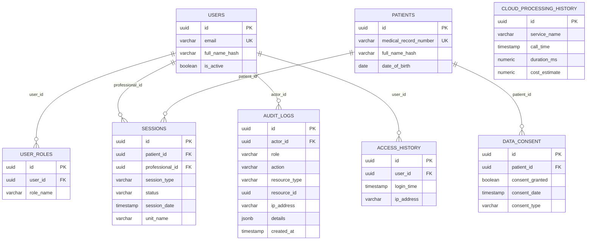

# DATABASE.md — GuardIA Parto Seguro

> Modelo de Dados, DDL e Relacionamentos — v1.0

---

## 1. Visão Geral

O sistema utiliza **PostgreSQL 16** com **schemas isolados por domínio** na mesma instância (ambiente de desenvolvimento). Em produção, cada serviço pode ter sua própria instância de banco.

| Schema | Domínio | Serviço |
|---|---|---|
| `core` | Core Platform | `backend/` |
| `video` | Video Analysis | `video-domain/` |
| `audio` | Audio Analysis | `audio-domain/` |
| `document` | Document Analysis | `document-domain/` |
| `cloud` | Cloud Integration | `cloud-domain/` |
| `security` | Security Domain | `security-domain/` |

---

## 2. Schema: `core` — Core Platform

### Diagrama ER



### DDL — Schema Core

```sql
-- ============================================
-- SCHEMA CORE
-- ============================================
CREATE SCHEMA IF NOT EXISTS core;

-- Extensões necessárias
CREATE EXTENSION IF NOT EXISTS "uuid-ossp";
CREATE EXTENSION IF NOT EXISTS "pgcrypto";

-- Enum para papéis de usuário
CREATE TYPE core.user_role AS ENUM ('admin', 'gestor', 'profissional', 'auditor');

-- Enum para status de sessão
CREATE TYPE core.session_status AS ENUM (
    'created', 'uploading', 'processing', 'completed', 'failed', 'cancelled'
);

-- Enum para tipo de mídia
CREATE TYPE core.media_type AS ENUM ('video', 'audio', 'document');

-- Enum para severidade de alerta
CREATE TYPE core.alert_severity AS ENUM ('low', 'moderate', 'critical');

-- Tabela de Usuários
CREATE TABLE core.users (
    id UUID PRIMARY KEY DEFAULT uuid_generate_v4(),
    email VARCHAR(255) NOT NULL UNIQUE,
    password_hash VARCHAR(255) NOT NULL,
    full_name VARCHAR(255) NOT NULL,
    role core.user_role NOT NULL DEFAULT 'profissional',
    is_active BOOLEAN NOT NULL DEFAULT TRUE,
    created_at TIMESTAMP WITH TIME ZONE NOT NULL DEFAULT NOW(),
    updated_at TIMESTAMP WITH TIME ZONE NOT NULL DEFAULT NOW()
);

-- Tabela de Pacientes (dados anonimizados)
CREATE TABLE core.patients (
    id UUID PRIMARY KEY DEFAULT uuid_generate_v4(),
    medical_record_number VARCHAR(50) NOT NULL UNIQUE,
    full_name_hash VARCHAR(64) NOT NULL, -- SHA-256 do nome
    date_of_birth DATE,
    consent_status VARCHAR(20) NOT NULL DEFAULT 'pending',
    consent_date TIMESTAMP WITH TIME ZONE,
    created_at TIMESTAMP WITH TIME ZONE NOT NULL DEFAULT NOW()
);

-- Tabela de Sessões Clínicas
CREATE TABLE core.sessions (
    id UUID PRIMARY KEY DEFAULT uuid_generate_v4(),
    patient_id UUID NOT NULL REFERENCES core.patients(id),
    professional_id UUID NOT NULL REFERENCES core.users(id),
    session_type VARCHAR(50) NOT NULL, -- consulta, parto, pos_parto
    status core.session_status NOT NULL DEFAULT 'created',
    session_date TIMESTAMP WITH TIME ZONE NOT NULL,
    unit_name VARCHAR(255),
    metadata JSONB DEFAULT '{}',
    created_at TIMESTAMP WITH TIME ZONE NOT NULL DEFAULT NOW(),
    updated_at TIMESTAMP WITH TIME ZONE NOT NULL DEFAULT NOW()
);

-- Tabela de Mídias da Sessão
CREATE TABLE core.session_media (
    id UUID PRIMARY KEY DEFAULT uuid_generate_v4(),
    session_id UUID NOT NULL REFERENCES core.sessions(id) ON DELETE CASCADE,
    media_type core.media_type NOT NULL,
    blob_url VARCHAR(2048),
    original_filename VARCHAR(500) NOT NULL,
    file_size_bytes BIGINT,
    status VARCHAR(20) NOT NULL DEFAULT 'uploaded',
    uploaded_at TIMESTAMP WITH TIME ZONE NOT NULL DEFAULT NOW()
);

-- Tabela de Alertas
CREATE TABLE core.alerts (
    id UUID PRIMARY KEY DEFAULT uuid_generate_v4(),
    session_id UUID NOT NULL REFERENCES core.sessions(id),
    alert_type VARCHAR(100) NOT NULL,
    severity core.alert_severity NOT NULL,
    description TEXT NOT NULL,
    metadata JSONB DEFAULT '{}',
    is_acknowledged BOOLEAN NOT NULL DEFAULT FALSE,
    acknowledged_by UUID REFERENCES core.users(id),
    acknowledgment_note TEXT,
    triggered_at TIMESTAMP WITH TIME ZONE NOT NULL DEFAULT NOW(),
    acknowledged_at TIMESTAMP WITH TIME ZONE
);

-- Tabela de Audit Log
CREATE TABLE core.audit_logs (
    id UUID PRIMARY KEY DEFAULT uuid_generate_v4(),
    user_id UUID REFERENCES core.users(id),
    action VARCHAR(100) NOT NULL,
    resource_type VARCHAR(100),
    resource_id UUID,
    ip_address INET,
    details JSONB DEFAULT '{}',
    created_at TIMESTAMP WITH TIME ZONE NOT NULL DEFAULT NOW()
);

-- Tabela de Consentimentos de Dados (LGPD)
CREATE TABLE core.data_consents (
    id UUID PRIMARY KEY DEFAULT uuid_generate_v4(),
    patient_id UUID NOT NULL REFERENCES core.patients(id),
    consent_granted BOOLEAN NOT NULL DEFAULT FALSE,
    consent_type VARCHAR(50) NOT NULL, -- video, audio, research
    consent_date TIMESTAMP WITH TIME ZONE NOT NULL DEFAULT NOW(),
    revoked_at TIMESTAMP WITH TIME ZONE
);

-- Índices
CREATE INDEX idx_sessions_patient ON core.sessions(patient_id);
CREATE INDEX idx_sessions_professional ON core.sessions(professional_id);
CREATE INDEX idx_sessions_status ON core.sessions(status);
CREATE INDEX idx_alerts_session ON core.alerts(session_id);
CREATE INDEX idx_alerts_severity ON core.alerts(severity);
CREATE INDEX idx_audit_user ON core.audit_logs(user_id);
CREATE INDEX idx_audit_created ON core.audit_logs(created_at DESC);

-- ============================================
-- SCHEMA SECURITY
-- ============================================
CREATE SCHEMA IF NOT EXISTS security;

CREATE TABLE security.user_roles (
    id UUID PRIMARY KEY DEFAULT uuid_generate_v4(),
    user_id UUID NOT NULL REFERENCES core.users(id),
    role_name VARCHAR(50) NOT NULL, -- admin, medico, enfermeiro, auditor
    granted_at TIMESTAMP WITH TIME ZONE NOT NULL DEFAULT NOW()
);

CREATE TABLE security.access_history (
    id UUID PRIMARY KEY DEFAULT uuid_generate_v4(),
    user_id UUID NOT NULL REFERENCES core.users(id),
    login_time TIMESTAMP WITH TIME ZONE NOT NULL DEFAULT NOW(),
    ip_address INET,
    user_agent VARCHAR(500)
);

-- ============================================
-- SCHEMA CLOUD
-- ============================================
CREATE SCHEMA IF NOT EXISTS cloud;

CREATE TABLE cloud.cloud_processing_history (
    id UUID PRIMARY KEY DEFAULT uuid_generate_v4(),
    service_name VARCHAR(100) NOT NULL, -- Azure Speech, Azure Doc Intel
    session_id UUID NOT NULL,
    call_time TIMESTAMP WITH TIME ZONE NOT NULL DEFAULT NOW(),
    duration_ms NUMERIC(10, 2),
    cost_estimate NUMERIC(10, 4) DEFAULT 0.0,
    status VARCHAR(20) NOT NULL
);
```

---

## 3. Schema: `video` — Video Analysis Domain

```sql
-- ============================================
-- SCHEMA VIDEO
-- ============================================
CREATE SCHEMA IF NOT EXISTS video;

CREATE TYPE video.job_status AS ENUM ('queued', 'processing', 'completed', 'failed');

CREATE TABLE video.video_jobs (
    id UUID PRIMARY KEY DEFAULT uuid_generate_v4(),
    session_id UUID NOT NULL,
    media_id UUID NOT NULL,
    blob_url VARCHAR(2048) NOT NULL,
    status video.job_status NOT NULL DEFAULT 'queued',
    ira_contribution NUMERIC(5,2),
    error_message TEXT,
    started_at TIMESTAMP WITH TIME ZONE,
    completed_at TIMESTAMP WITH TIME ZONE,
    created_at TIMESTAMP WITH TIME ZONE NOT NULL DEFAULT NOW()
);

CREATE TABLE video.video_results (
    id UUID PRIMARY KEY DEFAULT uuid_generate_v4(),
    job_id UUID NOT NULL REFERENCES video.video_jobs(id),
    session_id UUID NOT NULL,
    ira_score NUMERIC(5,2) NOT NULL,
    emotion_score NUMERIC(5,2),
    pose_score NUMERIC(5,2),
    object_risk_score NUMERIC(5,2),
    bleeding_score NUMERIC(5,2),
    total_frames INTEGER,
    analyzed_frames INTEGER,
    summary JSONB DEFAULT '{}',
    created_at TIMESTAMP WITH TIME ZONE NOT NULL DEFAULT NOW()
);

CREATE TABLE video.frame_analyses (
    id UUID PRIMARY KEY DEFAULT uuid_generate_v4(),
    job_id UUID NOT NULL REFERENCES video.video_jobs(id),
    frame_number INTEGER NOT NULL,
    timestamp_seconds NUMERIC(10,3) NOT NULL,
    emotion_data JSONB,
    pose_data JSONB,
    objects_detected JSONB,
    bleeding_detected BOOLEAN DEFAULT FALSE,
    risk_score NUMERIC(5,2),
    created_at TIMESTAMP WITH TIME ZONE NOT NULL DEFAULT NOW()
);

CREATE INDEX idx_video_jobs_session ON video.video_jobs(session_id);
CREATE INDEX idx_frame_analyses_job ON video.frame_analyses(job_id);
```

---

## 4. Schema: `audio` — Audio Analysis Domain

```sql
-- ============================================
-- SCHEMA AUDIO
-- ============================================
CREATE SCHEMA IF NOT EXISTS audio;

CREATE TABLE audio.audio_jobs (
    id UUID PRIMARY KEY DEFAULT uuid_generate_v4(),
    session_id UUID NOT NULL,
    media_id UUID NOT NULL,
    blob_url VARCHAR(2048) NOT NULL,
    status VARCHAR(20) NOT NULL DEFAULT 'queued',
    ira_contribution NUMERIC(5,2),
    error_message TEXT,
    started_at TIMESTAMP WITH TIME ZONE,
    completed_at TIMESTAMP WITH TIME ZONE,
    created_at TIMESTAMP WITH TIME ZONE NOT NULL DEFAULT NOW()
);

CREATE TABLE audio.transcriptions (
    id UUID PRIMARY KEY DEFAULT uuid_generate_v4(),
    job_id UUID NOT NULL REFERENCES audio.audio_jobs(id),
    session_id UUID NOT NULL,
    full_text TEXT,
    language_detected VARCHAR(10),
    duration_seconds NUMERIC(10,2),
    word_error_rate NUMERIC(5,3),
    created_at TIMESTAMP WITH TIME ZONE NOT NULL DEFAULT NOW()
);

CREATE TABLE audio.speaker_segments (
    id UUID PRIMARY KEY DEFAULT uuid_generate_v4(),
    transcription_id UUID NOT NULL REFERENCES audio.transcriptions(id),
    speaker_id VARCHAR(50) NOT NULL,
    start_time NUMERIC(10,3) NOT NULL,
    end_time NUMERIC(10,3) NOT NULL,
    text TEXT NOT NULL,
    sentiment VARCHAR(20),
    sentiment_confidence NUMERIC(5,3)
);

CREATE TABLE audio.risk_keywords (
    id UUID PRIMARY KEY DEFAULT uuid_generate_v4(),
    transcription_id UUID NOT NULL REFERENCES audio.transcriptions(id),
    keyword VARCHAR(255) NOT NULL,
    category VARCHAR(50) NOT NULL, -- dor, medo, coercao, depressao
    timestamp_seconds NUMERIC(10,3),
    speaker_id VARCHAR(50),
    context TEXT
);

CREATE TABLE audio.audio_scores (
    id UUID PRIMARY KEY DEFAULT uuid_generate_v4(),
    job_id UUID NOT NULL REFERENCES audio.audio_jobs(id),
    session_id UUID NOT NULL,
    ira_score NUMERIC(5,2) NOT NULL,
    sentiment_score NUMERIC(5,2),
    risk_keyword_score NUMERIC(5,2),
    prosody_score NUMERIC(5,2),
    summary JSONB DEFAULT '{}',
    created_at TIMESTAMP WITH TIME ZONE NOT NULL DEFAULT NOW()
);

CREATE INDEX idx_audio_jobs_session ON audio.audio_jobs(session_id);
CREATE INDEX idx_risk_keywords_category ON audio.risk_keywords(category);
```

---

## 5. Schema: `document` — Document Analysis Domain

```sql
-- ============================================
-- SCHEMA DOCUMENT
-- ============================================
CREATE SCHEMA IF NOT EXISTS document;

CREATE TABLE document.document_jobs (
    id UUID PRIMARY KEY DEFAULT uuid_generate_v4(),
    session_id UUID NOT NULL,
    media_id UUID NOT NULL,
    blob_url VARCHAR(2048) NOT NULL,
    document_type VARCHAR(50), -- prontuario, consentimento, exame, laudo
    status VARCHAR(20) NOT NULL DEFAULT 'queued',
    ira_contribution NUMERIC(5,2),
    error_message TEXT,
    created_at TIMESTAMP WITH TIME ZONE NOT NULL DEFAULT NOW()
);

CREATE TABLE document.document_results (
    id UUID PRIMARY KEY DEFAULT uuid_generate_v4(),
    job_id UUID NOT NULL REFERENCES document.document_jobs(id),
    session_id UUID NOT NULL,
    raw_text TEXT,
    extracted_fields JSONB DEFAULT '{}',
    completeness_score NUMERIC(5,2),
    ira_score NUMERIC(5,2) NOT NULL,
    created_at TIMESTAMP WITH TIME ZONE NOT NULL DEFAULT NOW()
);

CREATE TABLE document.consistency_checks (
    id UUID PRIMARY KEY DEFAULT uuid_generate_v4(),
    result_id UUID NOT NULL REFERENCES document.document_results(id),
    check_type VARCHAR(100) NOT NULL,
    passed BOOLEAN NOT NULL,
    details TEXT,
    severity VARCHAR(20)
);

CREATE TABLE document.consent_records (
    id UUID PRIMARY KEY DEFAULT uuid_generate_v4(),
    session_id UUID NOT NULL,
    consent_present BOOLEAN NOT NULL,
    consent_date TIMESTAMP WITH TIME ZONE,
    consent_type VARCHAR(100),
    professional_signature BOOLEAN DEFAULT FALSE,
    patient_signature BOOLEAN DEFAULT FALSE,
    created_at TIMESTAMP WITH TIME ZONE NOT NULL DEFAULT NOW()
);

CREATE INDEX idx_doc_jobs_session ON document.document_jobs(session_id);
```

---

## 6. Schema: `risk` — Risk Correlation Domain

```sql
-- ============================================
-- SCHEMA RISK
-- ============================================
CREATE SCHEMA IF NOT EXISTS risk;

CREATE TYPE risk.risk_level AS ENUM ('baixo', 'moderado', 'critico');

CREATE TABLE risk.ira_calculations (
    id UUID PRIMARY KEY DEFAULT uuid_generate_v4(),
    session_id UUID NOT NULL UNIQUE,
    patient_id UUID NOT NULL,
    ira_score NUMERIC(5,2) NOT NULL,
    risk_level risk.risk_level NOT NULL,
    video_score NUMERIC(5,2),
    video_weight NUMERIC(4,2) DEFAULT 0.40,
    audio_score NUMERIC(5,2),
    audio_weight NUMERIC(4,2) DEFAULT 0.35,
    document_score NUMERIC(5,2),
    document_weight NUMERIC(4,2) DEFAULT 0.25,
    calculation_notes TEXT,
    calculated_at TIMESTAMP WITH TIME ZONE NOT NULL DEFAULT NOW()
);

CREATE TABLE risk.risk_justifications (
    id UUID PRIMARY KEY DEFAULT uuid_generate_v4(),
    ira_id UUID NOT NULL REFERENCES risk.ira_calculations(id),
    component VARCHAR(20) NOT NULL, -- video, audio, document
    justification TEXT NOT NULL,
    key_indicators JSONB DEFAULT '[]',
    recommendation TEXT,
    created_at TIMESTAMP WITH TIME ZONE NOT NULL DEFAULT NOW()
);

CREATE TABLE risk.patient_risk_history (
    id UUID PRIMARY KEY DEFAULT uuid_generate_v4(),
    patient_id UUID NOT NULL,
    session_id UUID NOT NULL,
    ira_score NUMERIC(5,2) NOT NULL,
    risk_level risk.risk_level NOT NULL,
    session_date TIMESTAMP WITH TIME ZONE NOT NULL,
    created_at TIMESTAMP WITH TIME ZONE NOT NULL DEFAULT NOW()
);

CREATE INDEX idx_ira_session ON risk.ira_calculations(session_id);
CREATE INDEX idx_ira_patient ON risk.ira_calculations(patient_id);
CREATE INDEX idx_risk_history_patient ON risk.patient_risk_history(patient_id);
CREATE INDEX idx_risk_history_date ON risk.patient_risk_history(session_date DESC);
```

---

## 7. Schema: `report` — Reporting Domain

```sql
-- ============================================
-- SCHEMA REPORT
-- ============================================
CREATE SCHEMA IF NOT EXISTS report;

CREATE TYPE report.report_type AS ENUM ('session', 'executive', 'audit');
CREATE TYPE report.report_format AS ENUM ('pdf', 'excel');

CREATE TABLE report.reports (
    id UUID PRIMARY KEY DEFAULT uuid_generate_v4(),
    session_id UUID,
    report_type report.report_type NOT NULL,
    report_format report.report_format NOT NULL,
    title VARCHAR(255) NOT NULL,
    blob_url VARCHAR(2048),
    file_hash_sha256 VARCHAR(64),
    file_size_bytes BIGINT,
    generated_by UUID NOT NULL,
    generated_at TIMESTAMP WITH TIME ZONE NOT NULL DEFAULT NOW(),
    expires_at TIMESTAMP WITH TIME ZONE
);

CREATE INDEX idx_reports_session ON report.reports(session_id);
CREATE INDEX idx_reports_type ON report.reports(report_type);
```

---

## 8. Dados de Seed (Exemplo)

```sql
-- Usuário administrador padrão
INSERT INTO core.users (email, password_hash, full_name, role)
VALUES (
    'admin@guardia.health',
    crypt('Admin@2024!', gen_salt('bf')),
    'Administrador GuardIA',
    'admin'
);

-- Paciente de demonstração (dados anonimizados)
INSERT INTO core.patients (medical_record_number, full_name_hash, date_of_birth, consent_status)
VALUES (
    'DEMO-001',
    encode(digest('Paciente Demonstração', 'sha256'), 'hex'),
    '1990-01-01',
    'granted'
);
```
