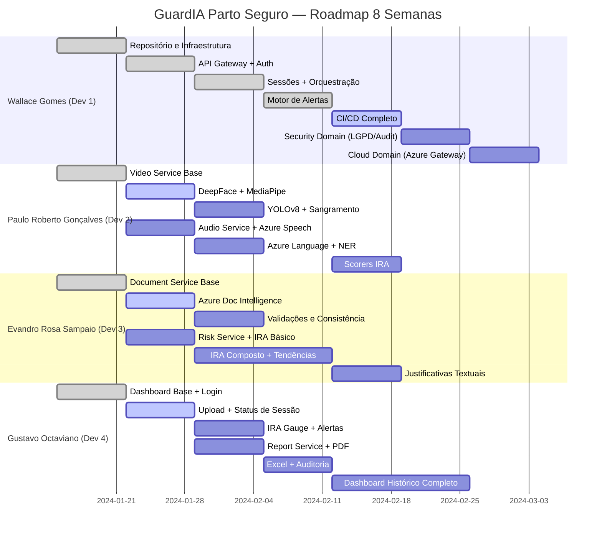

# ROADMAP.md — GuardIA Parto Seguro

> Roadmap de Execução — 8 Semanas — v1.0

---

## Visão Geral

---

## Semana 1 — Fundação e Infraestrutura

**Período:** Dias 1–7  
**Tema:** "Zero to Hello World"

### Objetivos
- Repositório Git estruturado com toda a estratégia de branches
- Ambiente local funcional com Docker Compose
- Todos os desenvolvedores com ambiente configurado

### Entregáveis por Desenvolvedor

| Dev | Entregável | Critério de Aceite |
|---|---|---|
| **Dev 1** | Repositório GitHub com CODEOWNERS, branch rules, PR template | Branches `main` protegida; PR template aparece ao abrir PR |
| **Dev 1** | Docker Compose com postgres e todos os serviços placeholder | `docker-compose up` sobe todos os containers sem erro |
| **Dev 1** | `.env.example` completo | Todos os devs conseguem configurar o ambiente |
| **Dev 2** | Scaffold do `video-domain/` com FastAPI básico | `GET /api/v1/video/health` retorna 200 |
| **Dev 2** | Scaffold do `audio-domain/` com FastAPI básico | `GET /api/v1/audio/health` retorna 200 |
| **Dev 3** | Scaffold do `document-domain/` com FastAPI básico | `GET /api/v1/documents/health` retorna 200 |
| **Dev 3** | Scaffold do `risk-domain/` com FastAPI básico | `GET /api/v1/risk/health` retorna 200 |
| **Dev 4** | Scaffold do `frontend/` Streamlit com tela de login | Tela de login renderiza sem erro |
| **Dev 4** | Scaffold do `report-domain/` com FastAPI básico | `GET /api/v1/reports/health` retorna 200 |

### Critérios de Aceite da Semana
- [x] `docker-compose up` funciona sem erros
- [x] Todos os 6 serviços respondem no healthcheck
- [ ] GitHub Actions roda lint básico (mesmo que vazio)
- [ ] README com instruções de setup testadas por todos

---

## Semana 2 — Core Funcional + Primeiras Análises

**Período:** Dias 8–14  
**Tema:** "Autenticação e Primeiras Análises"

### Objetivos
- API Gateway com auth JWT funcionando
- Primeiros resultados reais de análise de vídeo e áudio
- Integração Azure Document Intelligence

### Entregáveis

| Dev | Entregável | Critério de Aceite |
|---|---|---|
| **Dev 1** | Auth JWT completo (login, refresh, RBAC) | POST /auth/login retorna token; endpoints protegidos retornam 401 sem token |
| **Dev 1** | CRUD de sessões clínicas | POST /sessions cria sessão; GET /sessions/{id} retorna com status |
| **Dev 1** | Upload de mídia para Azure Blob | Arquivo de vídeo/áudio/doc é armazenado no Azure Blob |
| **Dev 2** | Pipeline de extração de frames (OpenCV) | 30 frames extraídos de vídeo de 1 min |
| **Dev 2** | DeepFace integrado (análise de emoções) | JSON com emoções detectadas retornado para vídeo de teste |
| **Dev 2** | Azure Speech STT básico | Transcrição de áudio de 1 min em pt-BR com ≥ 80% acurácia |
| **Dev 3** | Azure Document Intelligence integrado | Extração de texto de PDF de prontuário funcionando |
| **Dev 3** | Extrator de campos obstétricos | Campos chave (CID, medicamentos, data) extraídos corretamente |
| **Dev 4** | Página de sessões no dashboard | Lista de sessões com status visível |
| **Dev 4** | Upload de mídia via dashboard | Upload de arquivo a partir do Streamlit funciona |

---

## Semana 3 — Análise Avançada

**Período:** Dias 15–21  
**Tema:** "IA em Ação"

### Entregáveis

| Dev | Entregável | Critério de Aceite |
|---|---|---|
| **Dev 1** | Orquestrador multimodal | Ao fazer upload, os 3 serviços de análise são chamados em paralelo |
| **Dev 1** | Sistema de notificações por e-mail | E-mail enviado ao gestor para IRA crítico (testado com mock) |
| **Dev 2** | MediaPipe Holistic integrado | Pose landmarks detectados e classificados (normal/defensivo) |
| **Dev 2** | YOLOv8 integrado | Objetos detectados em frame de teste com bounding boxes |
| **Dev 2** | Speaker Diarization (Azure Speech) | Transcrição com Speaker_0 e Speaker_1 identificados |
| **Dev 3** | Checklist de completude de prontuário | Score de completude (0-100) calculado para prontuário de teste |
| **Dev 3** | Risk Service com IRA básico (um componente) | IRA calculado corretamente com apenas score de vídeo |
| **Dev 4** | IRA Gauge no dashboard | Indicador visual do IRA (0-100) renderiza com cores corretas |
| **Dev 4** | Report Service básico (PDF) | PDF gerado com dados de sessão de teste |

---

## Semana 4 — Integração e Alertas

**Período:** Dias 22–28  
**Tema:** "Tudo Conectado"

### Entregáveis

| Dev | Entregável | Critério de Aceite |
|---|---|---|
| **Dev 1** | Motor de alertas funcionando | Alerta disparado automaticamente quando IRA ≥ 40 |
| **Dev 1** | Endpoint de reconhecimento de alertas | PATCH /alerts/{id}/acknowledge atualiza status |
| **Dev 1** | Security Domain funcional | Rotas de auditoria e validação JWT RBAC funcionais |
| **Dev 2** | Detecção de sangramento (OpenCV HSV) | Sangramento detectado em frame de teste com cor vermelha |
| **Dev 2** | IRA Scorer de vídeo | Score de vídeo normalizado (0-100) retornado pela API |
| **Dev 2** | Azure AI Language (sentimento + NER) | Sentimento e entidades clínicas extraídos da transcrição |
| **Dev 3** | Validação de consentimento informado | Campo consentimento verificado e resultado armazenado |
| **Dev 3** | IRA composto com 2+ componentes | IRA calculado corretamente com vídeo + áudio |
| **Dev 4** | Central de alertas no dashboard | Lista de alertas com filtros por severidade e status |
| **Dev 4** | Download de PDF via dashboard | Usuário clica e faz download do relatório PDF |

---

## Semana 5 — Scorers e Qualidade

**Período:** Dias 29–35  
**Tema:** "Qualidade e Completude"

### Entregáveis

| Dev | Entregável | Critério de Aceite |
|---|---|---|
| **Dev 1** | GitHub Actions completo (lint+test+security+build) | Pipeline roda em ≤ 5 min e bloqueia merge se falhar |
| **Dev 1** | Cobertura de testes ≥ 80% no backend | `pytest --cov` reporta ≥ 80% |
| **Dev 1** | Cloud Integration Domain finalizado | Proxy para Azure Speech e Blob operando |
| **Dev 2** | IRA Scorer de áudio completo | Score inclui sentimento + keywords + prosódia |
| **Dev 2** | Cobertura de testes ≥ 80% no video-domain e audio-domain | Verificado no CI |
| **Dev 3** | IRA Scorer documental completo | Score inclui completude + inconsistências + consentimento |
| **Dev 3** | Análise de tendências do IRA | Gráfico de tendência retornado pelo Risk Service |
| **Dev 4** | Relatório Excel executivo | Planilha com IRA, alertas e resumo da sessão |
| **Dev 4** | Relatório de auditoria com hash SHA-256 | Hash registrado no banco após geração |

---

## Semana 6 — IRA Composto e Dashboard Final

**Período:** Dias 36–42  
**Tema:** "Experiência Completa"

### Entregáveis

| Dev | Entregável | Critério de Aceite |
|---|---|---|
| **Dev 1** | Integração completa de ponta a ponta | Upload → Análises → IRA → Alerta → Relatório em sequência |
| **Dev 2** | Fluxo completo vídeo + áudio sem erros | Sessão com vídeo e áudio processada sem erros |
| **Dev 3** | IRA com os 3 componentes e justificativas textuais | Justificativas por componente retornadas pela API |
| **Dev 3** | Cobertura ≥ 80% no document-domain e risk-domain | Verificado no CI |
| **Dev 4** | Dashboard completo com mapa de calor temporal | Heatmap do IRA ao longo do tempo do vídeo renderizado |
| **Dev 4** | Dashboard com histórico da paciente | Gráfico de tendência histórica do IRA da paciente |

---

## Semana 7 — Testes de Integração e Correções

**Período:** Dias 43–49  
**Tema:** "Estabilidade"

### Objetivos
- Todos os domínios integrados e testados end-to-end
- Bugs críticos corrigidos
- Performance validada

### Entregáveis

| Entregável | Responsável | Critério de Aceite |
|---|---|---|
| Testes de integração completos | Todos | Fluxo ponta a ponta com dados reais sem erros |
| Performance de vídeo | Dev 2 | Vídeo de 30 min processado em ≤ 15 min |
| Stress test da API | Dev 1 | API suporta 10 requisições simultâneas sem timeout |
| Documentação OpenAPI atualizada | Dev 1 | Swagger de todos os serviços correto e completo |
| LGPD compliance review | Dev 3 | Dados anonimizados, log de auditoria funcionando |

---

## Semana 8 — Preparação para Apresentação

**Período:** Dias 50–56  
**Tema:** "Demo Day Ready"

### Objetivos
- Sistema estável com dados de demonstração
- Roteiro de apresentação ensaiado
- Release v1.0.0 publicada

### Entregáveis

| Entregável | Responsável | Critério de Aceite |
|---|---|---|
| Dataset de demonstração | Dev 2 + Dev 3 | 3 sessões de demo com diferentes níveis de IRA |
| Vídeo de demonstração (5 min) | Dev 4 | Gravação do fluxo completo de uso |
| Tag v1.0.0 no GitHub | Dev 1 | Release publicada com changelog |
| Slides da apresentação | Todos | Cobertura de todos os tópicos do roteiro |
| Documentação final revisada | Todos | Todos os docs completos e consistentes |
| Deploy em ambiente de demonstração | Dev 1 | Sistema acessível em URL pública para a banca |

---

## Marcos (Milestones)

| Marco | Data | Descrição |
|---|---|---|
| 🏁 **M1 — Hello World** | Fim Semana 1 | Todos os serviços rodando localmente |
| 🔐 **M2 — Auth + Upload** | Fim Semana 2 | Auth JWT + primeiras análises |
| 🤖 **M3 — MVP Funcional** | Fim Semana 4 | Fluxo completo funcionando |
| 📊 **M4 — IRA Completo** | Fim Semana 6 | IRA com 3 componentes e dashboard |
| ✅ **M5 — Release v1.0.0** | Fim Semana 8 | Sistema pronto para apresentação |

---

## Definição de Pronto (DoD)

Uma funcionalidade está **PRONTA** quando:
- [ ] Implementada e testada localmente
- [ ] Testes unitários escritos (cobertura ≥ 80%)
- [ ] Lint passando (ruff + black)
- [ ] PR aberto, revisado e aprovado por ≥ 1 colega
- [ ] CI/CD passando no GitHub Actions
- [ ] Merged na `main`
- [ ] Documentação atualizada (se necessário)
